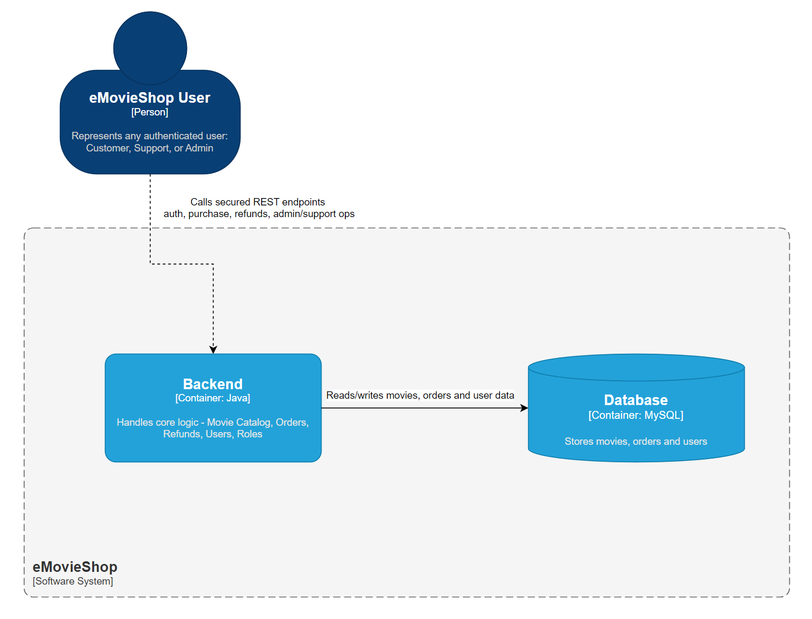
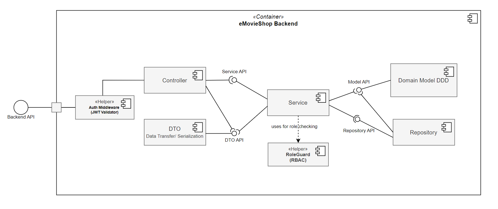
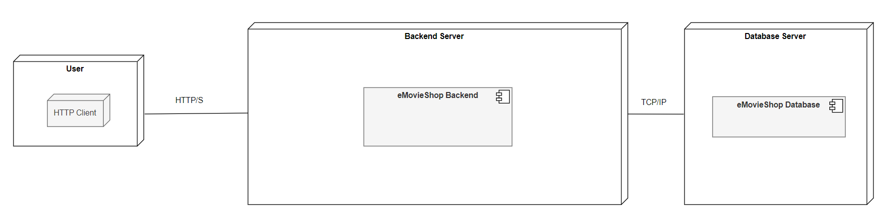
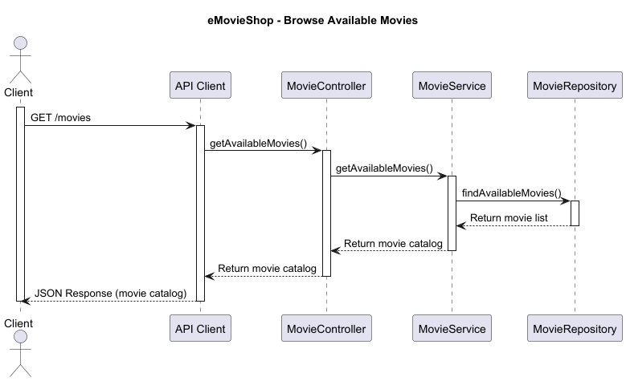
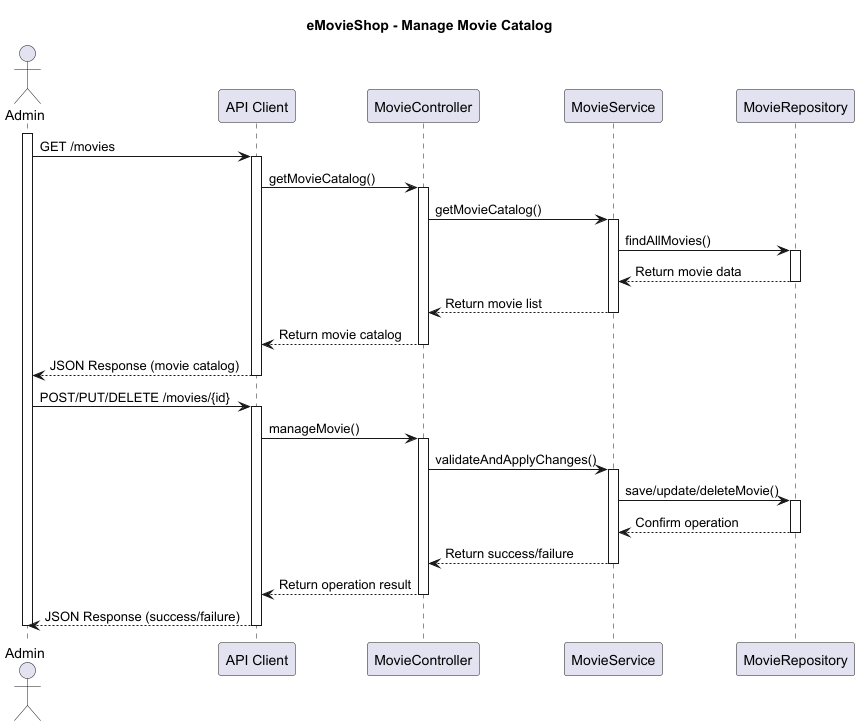

## 2 Architecture/Design

### 2.1 Components

#### 2.1.1 High-Level

This high-level diagram outlines the core containers of the eMovieShop system, divided across backend and infrastructure responsibilities.

- **User** interacts with the application via an **API Client**, accessing the **eMovieShop Backend**.

**External Services**:

- **Auth0** is the external identity provider responsible for all authentication flows. It issues signed JWTs after the user 
authenticates. The backend validates every incoming token against Auth0's JWKS endpoint. It never generates tokens itself. 
Auth0 also exposes user profile and role metadata consumed by the backend's authorization layer.

**Backend Container**:

- **eMovieShop Backend** is a secured REST API.
- It handles:
    - **JWT-based authentication** via middleware, with JWTs issued by **Auth0** as the external IdP.
    - **Role-based authorization** (RBAC) using a `RoleGuard` helper.
    - Execution of core business logic for ordering, refunding, user role management, and movie catalog administration.
- The backend interacts with a **Database** for persistent state.

**Database**:

- A **Relational Database** stores all business entities, including:
    - Users, Movies, Orders, Refund Requests, and Roles.
- It supports queries from both the backend services and audit logging components.

#### 2.1.2 Backend

This diagram illustrates the internal architecture of the eMovieShop backend, designed with layered responsibilities and Domain-Driven Design (DDD).

- Incoming requests enter through the **Backend API**, carrying a `Bearer <JWT>` in the `Authorization` header.
- Requests are intercepted by the **Auth Middleware / JWT Middleware**, which validates JWTs issued by **Auth0** by checking the signature or MAC with trusted issuer key material and then verifying token claims such as issuer, audience, and expiry before blocking or allowing access to the controller layer.
- The **Controller** handles HTTP routing and delegates logic to the **Service Layer** using structured **DTOs**, which serve as a serialization and data-mapping layer.
- The **Service Layer** performs business operations such as movie purchases, refund processing, and role assignments.
    - It consults **Domain Models** through a **Model API**.
    - It accesses persistence through a **Repository API**.
    - It enforces role-based access control via a **RoleGuard**, ensuring actions are authorized.
- The **Domain Model** includes core aggregates like `User`, `Movie`, `Order`, and `RefundRequest`, encapsulating business rules and invariants.
- The **Repository** implements data persistence using domain entities, connected to a **MySQL Database**, abstracted behind repository interfaces.

The backend enforces security at multiple layers (middleware, services) and clearly separates concerns between API handling, 
domain logic, and data persistence. In particular, the **JWT Middleware** is responsible for verifying that self-contained tokens issued by **Auth0** are authentic and unmodified before downstream components trust claims such as user identity or role.

### 2.2 Deployment

This deployment diagram represents the physical architecture of eMovieShop, deployed across three main servers and supported 
by external services.

- **Users** authenticate through **Auth0** (external IdP), which issues a signed JWT access token upon successful login.
- Users then access the system via an HTTP client which:
    - Calls the **Backend Server API**, attaching a `Bearer <JWT>` token received from Auth0 in the `Authorization` header.
- The **Backend Server** is responsible for:
    - **Validating JWT tokens** via middleware by fetching Auth0's public JWKS and verifying the token signature, issuer (`iss`), and audience (`aud`).
    - **Enforcing role-based access** using a `RoleGuard` component, reading role claims embedded in the Auth0 token.
    - Executing core business logic like purchases, refunds, and role changes.
- The **Auth0 External Service** provides:
    - OAuth 2.0 / OpenID Connect login flows.
    - Centralized user identity and role management.
    - Token revocation and session lifecycle management.
- The **Database Server** handles persistence for:
    - Users, roles, movies, orders, and refund requests.
    - Audit trails are recorded separately in the **Database Audit Logger**.

*Communication flows over secure HTTPS between the HTTP client, backend, and external services. Internal service-to-service 
communication (backend to database) uses TCP/IP.*

To align with secure deployment practices and the principle of the least privilege, each major server component is intended 
to run under its own dedicated low-privilege operating system account. This ensures compartmentalization and reduces the impact 
surface of a potential compromise:

- `emovieshop_backend`: Executes API logic with limited filesystem and network permissions.
- `emovieshop_db`: Dedicated database user with restricted access to only the required schema and operations.
- External services are accessed over HTTPS with API keys stored securely in environment variables, not in code or user accounts.

This operating model can be enforced via Docker container users or systemd service accounts.

### 2.3 Technology Stack

|     Component     | Technology Stack |
|:-----------------:|:----------------:|
|      Backend      |       Java       |
|     Database      |      MySQL       |
| Identity Provider | Auth0 (External) |

### 2.4 Secure Design Patterns

| **Pattern**                     | **eMovieShop Adaptation**                                                                                                                                                                                                                                                                                                                    |
|---------------------------------|----------------------------------------------------------------------------------------------------------------------------------------------------------------------------------------------------------------------------------------------------------------------------------------------------------------------------------------------|
| **Secure by Default**           | Unauthorized actions (e.g., unauthorized refunds or admin actions) are blocked by default using the `RoleGuard` check on the backend. Missing or invalid JWTs deny access automatically.                                                                                                                                                     |
| **Layered Security**            | Security is applied at multiple levels: input is validated on the backend; JWTs are verified at every request; and role-based access is enforced server-side.External services (Auth0) are acessed over secure channels only.                                                  |
| **Minimal Access Rights**       | Each user role (Admin, Support, Customer) has only the permissions it needs. For example, only Support can approve refunds; Admins manage catalog and roles; Customers can only view/request their own orders.                                                                                                                               |
| **Transparent Security Design** | The system does not rely on “security through obscurity.” Instead, it uses open, testable mechanisms like JWT, RBAC, and clearly defined API interfaces for enforcing access control.                                                                                                                                                        |
| **Clean & Safe Code Practices** | Code is organized into layered components (DTO, Service, Controller, etc.), centralizes security logic (e.g., Auth Middleware), and uses best practices like clear naming, error handling, and input sanitation.                                                                                                                             |
| **Session Binding and Entropy** | JWTs are issued and signed by Auth0 using RS256 with ≥64 bits of entropy. Tokens are sent via the 'Authorization' header.                                                                         |
| **Third-Party Dependency Risk** | Auth0 is integrated as the sole external identity dependency. Communication with Auth0 endpoints is over HTTPS only; the Auth0 tenant domain and client credentials are stored in environment variables, never in source code. The backend caches Auth0's JWKS for a bounded TTL to reduce latency and limit exposure to Auth0 availability. |

eMovieShop’s architecture integrates key secure design patterns in the backend. **Secure by Default** is 
enforced via the `Auth Middleware`, which validates Auth0-issued JWTs and blocks unauthenticated users before reaching controllers. **Layered Security** 
is applied through the backend's layered architecture: the backend enforces constraints through DTOs, 
services, and immutable domain value objects like `Email` or `MovieTitle`. The introduction of **Auth0** adds a new security 
layer by centralizing identity management, token issuance, and session lifecycle outside the application boundary. **Least Privilege** 
is reflected in the `RoleGuard` service, restricting backend logic based on role claims carried inside Auth0 tokens, and in use 
cases tied to specific actors (e.g., only support can process refunds). The system embraces **Open Design**,  JWT, RBAC, and 
authorization mechanisms (including Auth0’s OIDC/OAuth 2.0 flows) are explicitly modeled in diagrams and thoroughly documented. 
Lastly, **Coding Best Practices** are seen in the clear separation of concerns from API to domain in the backend and DDD patterns 
in the domain model.

Additionally, the architecture defines concrete security controls for implementation:

- **JWT validation policy:** The backend validates signature and claims (`iss`, `aud`, `exp`) on every protected request, allows only RS256 for Auth0-issued access tokens, and accepts a maximum clock skew tolerance of 60 seconds.
- **API abuse protection:** Baseline limits are 120 requests/min per authenticated user, 300 requests/min per IP, and 30 requests/min per IP for login/token endpoints; exceeded limits return `429 Too Many Requests`.
- **Request size limits:** Request bodies are limited to 1 MB globally, with stricter limits of 64 KB for authentication requests and 256 KB for refund payloads, matching the API's JSON-only scope.
- **Transport security baseline:** External communication is HTTPS-only with TLS 1.2 minimum (TLS 1.3 preferred); TLS 1.0/1.1 and plaintext fallback are disabled.
- **Security logging and error handling:** Authentication failures, authorization denials, refund decisions, and role changes are logged as security events. Error responses are sanitized, include a correlation ID, and use stable status semantics (`400`, `401`, `403`, `404`, `409`, `429`, `500`). Log retention baseline is 90 days online and 365 days archived.
- **HTTP security headers at API boundary:** Responses include `X-Content-Type-Options: nosniff`, `Referrer-Policy: no-referrer`, `Permissions-Policy: camera=(), microphone=(), geolocation=()`, and `Content-Security-Policy: default-src 'none'; frame-ancestors 'none'; base-uri 'none'`; CORS follows allowlist-only policy (deny by default).

These values are intentionally aligned with the operational baselines defined in Domain Analysis/Requirements to keep architecture and requirements documentation consistent.

### 2.5 Sequence Diagrams

**UC1:**

**UC2:**

**UC3:**

**UC4:**

**UC5:**

**UC6:**

**UC7:**

**UC8:**

