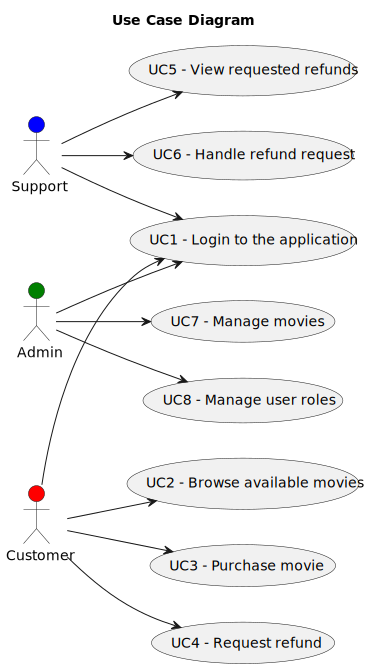

# Domain Analysis and Requirements

## Table of Contents

- [List of Figures](#list-of-figures)
- [1. Domain Analysis](#1-domain-analysis)
- [2. Use Cases](#2-use-cases)

## List of Figures

| Figure Number | Figure Description |
|:-------------:|:------------------:|
|               |                    |
|   Figure 2    |  Use Case Diagram  |
|               |                    |
|               |                    |
|               |                    |
|               |                    |
|               |                    |
|               |                    |

## 1. Domain Analysis

## 2. Use Cases

| UC Number |       Description        |         Actor(s)         |
|:---------:|:------------------------:|:------------------------:|
|    UC1    | Login to the application | Customer, Support, Admin |
|    UC2    | Browse available movies  |         Customer         |
|    UC3    |      Purchase movie      |         Customer         |
|    UC4    |      Request refund      |         Customer         |
|    UC5    |  View requested refunds  |         Support          |
|    UC6    |  Handle refund request   |         Support          |
|    UC7    |   Manage movie catalog   |          Admin           |
|    UC8    |    Manage user roles     |          Admin           |
|    UC9    |                          |                          |

  

<em>Figure 2 – Use case diagram.</em>

## 3. 