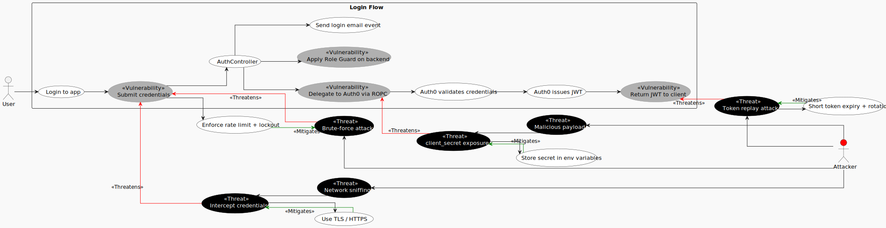
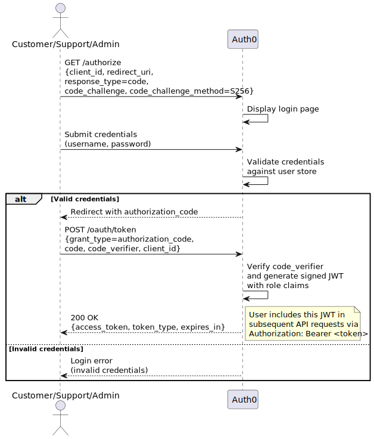

# Use Case 1: Login to the application

## Index
- [1. Description](#1-description)
	- [1.1 Objective](#11-objective)
	- [1.2 Actors](#12-actors)
	- [1.3 Use/Abuse Case Diagram](#13-useabuse-case-diagram)
	- [1.4 Pre-conditions](#14-pre-conditions)
	- [1.5 Post-conditions](#15-post-conditions)
- [2. Interaction Flow & Architecture](#2-interaction-flow--architecture)
	- [2.1 Interaction Flow (API Level)](#21-interaction-flow-api-level)
	- [2.2 Sequence Diagram](#22-sequence-diagram)
- [3. Threat Analysis](#3-threat-analysis)
	- [3.1 STRIDE Table](#31-stride-table)
- [4. Security Requirements (ASVS Compliance)](#4-security-requirements-asvs-compliance)
- [5. Secure Development Requirements](#5-secure-development-requirements)

## 1. Description
### 1.1 Objective

This Use Case allows any registered user (Customer, Support, or Admin) to authenticate into the eMovieShop system. 
Authentication is performed directly against Auth0 (the external Identity Provider). Upon successful login, Auth0 issues a signed JWT access token, which the user then includes in all subsequent API requests to the backend. 
The backend never receives or processes user credentials, it only validates the JWT.

### 1.2 Actors

* **Customer:** Primary actor authenticating to browse and purchase movies.
* **Support:** Actor authenticating to manage refund requests.
* **Admin:** Actor authenticating to manage the catalogue and assign user roles.

### 1.3 Use/Abuse Case Diagram

This diagram illustrates the legitimate authentication path, where the user is redirected to Auth0's login page via the Authorization Code + PKCE flow and receives a signed JWT, versus potential abuse scenarios, including brute-force attacks against Auth0's login page, credential interception via network sniffing, authorization code interception, and token replay attacks targeting the issued JWT.

### 1.4 Pre-conditions
* The actor must have a registered account in the Auth0 tenant.
* The actor must provide valid credentials (username and password).
* The API must be reachable and the Auth0 tenant must be operational.

### 1.5 Post-conditions
* A valid JWT access token is issued by Auth0 and returned to the actor.
* The token contains the actor's role claims for downstream authorization.
* An audit log entry is created recording the authentication attempt (success or failure).

---

## 2. Interaction Flow & Architecture
Authentication is handled entirely outside the backend using the OAuth 2.0 Authorization Code flow with PKCE (Proof Key for Code Exchange). Since eMovieShop is a backend-only REST API, the Actor uses an API client (e.g., Postman) to initiate the flow. Postman opens a browser window to Auth0's login page, where the user authenticates directly with Auth0. After a successful login, Postman receives the signed JWT and uses it in subsequent requests to the backend. The backend never receives user credentials, it only validates the JWT.

### 2.1 Interaction Flow (API Level)
1. **Authorization Request:** The Actor initiates login via Postman, which triggers a `GET /authorize` request to Auth0 with `response_type=code`, `client_id`, `redirect_uri`, `code_challenge` (SHA-256 hash of a random `code_verifier`), and `code_challenge_method=S256`. Postman opens a browser window for this step.
2. **User Authentication:** Auth0 displays its login page. The Actor submits their credentials (username and password) directly on Auth0's page. The backend is not involved in this step and never receives the user's credentials.
3. **Authorization Code:** Auth0 validates the credentials and, if valid, redirects back to Postman's callback URL with an `authorization_code`.
4. **Token Exchange:** Postman automatically sends a `POST /oauth/token` request to Auth0 with `grant_type=authorization_code`, the `code`, and the original `code_verifier`. Auth0 verifies the `code_verifier` against the `code_challenge` to prevent authorization code interception.
5. **Token Issuance:** Auth0 issues a signed JWT access token containing the actor's role claims.
6. **API Access:** The Actor uses Postman to send requests to backend endpoints (e.g., `GET /api/movies`, `POST /api/orders`) including the JWT in the `Authorization: Bearer` header.
7. **Token Validation:** The backend's `AuthMiddleware` validates the JWT signature against Auth0's JWKS endpoint, verifies claims (`iss`, `aud`, `exp`), and grants or denies access accordingly.

### 2.2 Sequence Diagram

This diagram shows the Authorization Code + PKCE authentication flow between the Actor and Auth0. In practice, Postman orchestrates this flow (opening the browser for login and handling the code exchange), but the diagram focuses on the logical interaction: credentials are submitted directly on Auth0's login page and the JWT is obtained via a secure code exchange, without any backend involvement.

---

## 3. Threat Analysis

Specific threats to the login process were evaluated using STRIDE.

### 3.1 STRIDE Table

| Threat                                                                            | Category                               | Mitigation Strategy                                                                                          |
|:----------------------------------------------------------------------------------|:---------------------------------------|:-------------------------------------------------------------------------------------------------------------|
| Attacker submits forged or tampered credentials to impersonate a legitimate user  | **Spoofing**                           | Credentials are validated exclusively by Auth0; the backend never handles password verification directly.    |
| JWT is intercepted in transit and reused by an attacker                           | **Information Disclosure / Spoofing**  | Enforced use of TLS (HTTPS) for all API communications (ASVS 9.1.1).                                         |
| Attacker performs brute-force or credential stuffing against Auth0's login page   | **Denial of Service / Spoofing**       | Auth0 anomaly detection and attack protection; account lockout after 10 failed attempts.                      |
| Attacker replays a captured valid JWT to gain unauthorized access                 | **Elevation of Privilege**             | Short token expiration (`expires_in`) and enforcement of token validation on every protected request.        |

---

## 4. Security Requirements (ASVS Compliance)

Based on the ASVS checklist, the following requirements are strictly enforced for this UC:

* **ASVS V6.1.1 and V6.3.1 (Authentication):** User authentication is fully delegated to Auth0, a certified identity provider, and the login flow is protected against credential stuffing and brute-force attempts. The backend never stores or processes plaintext passwords.
* **ASVS V6.8.2 (Authentication with an Identity Provider):** The user authenticates directly with Auth0, and the integrity of the returned JWT is validated by the backend before granting access.
* **ASVS V12.2.1 and V12.3.1 (Secure Communication):** All communication between the API client, the backend, and Auth0 is enforced over TLS to prevent interception of credentials or tokens in transit.
* **ASVS V16.3.1 and V16.3.3 (Security Logging):** Authentication events (successful logins and failed attempts) and attempts to bypass authentication controls are logged with sufficient metadata (timestamps, source IP, and actor identity) to support forensic investigation and anomaly detection.

---

## 5. Secure Development Requirements
* **Code Review:** Any changes to the `AuthMiddleware` JWT validation logic or the Auth0 integration configuration require a security-focused peer review, particularly regarding how token claims and the JWKS endpoint are handled.
* **Automated Testing:** Unit and integration tests must cover scenarios of failed authentication (invalid credentials, missing fields, expired tokens) to ensure the system responds correctly without leaking sensitive information in error messages.
* **Secret Management:** The Auth0 `audience` and `issuer` configuration values must be managed via environment variables and must never appear in source control. A secrets scanning tool should be integrated into the CI/CD pipeline.