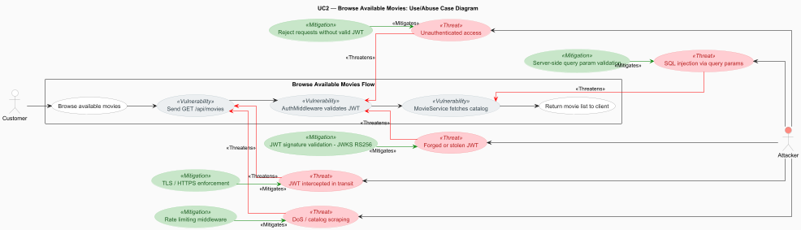

# Use Case 2: Browse Available Movies

## Index
- [1. Description](#1-description)
	- [1.1 Objective](#11-objective)
	- [1.2 Actors](#12-actors)
	- [1.3 Use/Abuse Case Diagram](#13-useabuse-case-diagram)
	- [1.4 Pre-conditions](#14-pre-conditions)
	- [1.5 Post-conditions](#15-post-conditions)
- [2. Interaction Flow & Architecture](#2-interaction-flow--architecture)
	- [2.1 Interaction Flow (API Level)](#21-interaction-flow-api-level)
	- [2.2 Sequence Diagram](#22-sequence-diagram)
- [3. Threat Analysis](#3-threat-analysis)
	- [3.1 STRIDE Table](#31-stride-table)
- [4. Security Requirements (ASVS Compliance)](#4-security-requirements-asvs-compliance)
- [5. Secure Development Requirements](#5-secure-development-requirements)

## 1. Description
### 1.1 Objective
This Use Case allows authenticated Customers to retrieve and view the list of available movies in the eMovieShop catalog.
It provides customers with visibility into what movies are currently on offer, including titles, genres, prices, and stock 
availability, so they can make informed purchasing decisions.

### 1.2 Actors
* **Customer:** Primary actor browsing the movie catalog.

### 1.3 Use/Abuse Case Diagram
This diagram illustrates the legitimate path for retrieving the movie catalog versus potential abuse scenarios, such as 
unauthenticated users attempting to access the catalog or attackers scraping pricing and availability data.

### 1.4 Pre-conditions
* The actor must be successfully authenticated via Auth0.
* The actor must possess a valid JWT signed with RS256, with at least 64 bits of entropy, carrying the `"Customer"` role claim.
* The JWT must not be expired (Customer sessions expire after 6 hours or 30 minutes of inactivity).

### 1.5 Post-conditions
* The list of available movies (with available stock) is successfully retrieved from the database.
* The information is returned to the actor in a structured JSON response containing movie titles, genres, prices, and stock quantities.
* An audit log entry is created recording the access to the movie catalog, including user ID, role, timestamp, and source IP.

---

## 2. Interaction Flow & Architecture
As the system is a backend-only API, the interaction follows a direct request-response pattern between the client and the server.

### 2.1 Interaction Flow (API Level)
1. **Request:** The Customer (via API Client) sends a `GET` request to `/api/movies` including the JWT in the `Authorization: Bearer` header. Optional query parameters (e.g., genre filter, search term, pagination) may be included.
2. **Authentication:** The `AuthMiddleware` verifies the JWT signature against Auth0's JWKS endpoint using RS256. Expired or malformed tokens are rejected with `401 Unauthorized`.
3. **Authorization:** The `RoleGuard` confirms the actor holds the `Customer` role. Requests from unrecognized roles are rejected with `403 Forbidden`.
4. **Input Validation:** Query parameters are validated server-side for type, format, and permitted range before reaching the business logic layer.
5. **Business Logic:** The `MovieController` invokes the `MovieService` to retrieve all movies with available stock from the repository.
6. **Response:** The system returns a `200 OK` status with the JSON array containing the movie catalog details.

### 2.2 Sequence Diagram
This diagram shows the internal backend logic and the sequence of calls between the Controller, Service, and Repository, highlighting the enforcement of security rules at the service layer.

---

## 3. Threat Analysis
Specific threats to the process of browsing available movies were evaluated using STRIDE and Attack Trees. Threat IDs and risk scores reference the system-wide [Threat Model](../../ThreatModel/threatModel.md).

### 3.1 STRIDE Table
| Threat                                                                                        | Category                   | Mitigation Strategy                                                                                               |
|:----------------------------------------------------------------------------------------------|:---------------------------|:------------------------------------------------------------------------------------------------------------------|
| Attacker uses a forged or stolen JWT to impersonate a Customer (U1, B1 — Risk 12/10)          | **Spoofing**               | JWT signature validated against Auth0 JWKS (RS256) on every request; unsigned or malformed tokens rejected `401`. |
| Customer manually crafts requests targeting Support or Admin endpoints (U6 — Risk 12)         | **Elevation of Privilege** | `RoleGuard` enforces `Customer` role server-side; any role mismatch returns `403 Forbidden`.                      |
| Attacker injects malicious input via query parameters, e.g., search field (B3 — Risk 9)       | **Tampering**              | Server-side validation of all query parameters for type, format, and range before reaching `MovieService`.        |
| Verbose error responses expose stack traces or internal service details (B6 — Risk 12)        | **Information Disclosure** | Generic error messages returned to clients; internal identifiers and stack traces never included in responses.    |
| Attacker floods `GET /api/movies` to cause DoS or scrape full catalog data (U5, B7 — Risk 12) | **Denial of Service**      | Rate limiting middleware applied to the endpoint; `429` returned on threshold breach.                             |
| Unbounded catalog query with no pagination saturates database resources (D6 — Risk 9)         | **Denial of Service**      | Query result sets are paginated and limited server-side; requests without valid pagination parameters rejected.   |
| JWT or credentials intercepted in transit via network sniffing (U4 — Risk 8)                  | **Information Disclosure** | TLS enforced for all client-to-backend communications (ASVS V12.1.1); no plaintext fallback permitted.            |

---

## 4. Security Requirements (ASVS Compliance)
Based on the ASVS 5.0 checklist, the following requirements are most relevant to this UC:

* **ASVS V2.2.1 and V2.2.2 (Input Validation):** All query parameters, such as genre filters, search terms, and pagination values, are validated server-side to enforce business expectations before reaching `MovieService`. Only movies with available `StockQuantity` are returned, preserving the domain invariant at the service layer.

* **ASVS V2.4.1 (Anti-automation):** Rate limiting is applied to `GET /api/movies` to prevent catalog scraping and denial-of-service conditions. Requests exceeding the defined threshold per time window are rejected with `429 Too Many Requests`.

* **ASVS V8.2.1 and V8.3.1 (Authorization):** Function-level access is restricted to consumers with explicit permissions. The `RoleGuard` ensures that only authenticated customers can invoke `GET /api/movies`; other users are rejected with `403 Forbidden` at the controller layer.
* **ASVS V9.1.1 and V9.2.1 (Self-contained Tokens):** The JWT issued by Auth0 is validated using its digital signature before any claim is trusted, and the `exp` / `nbf` validity window is enforced on every request. Expired, malformed, or unsigned tokens are rejected with `401 Unauthorized`.

* **ASVS V9.2.2 and V9.2.3 (Self-contained Tokens):** The backend only accepts tokens intended for this API and validates the `aud` claim before using the token contents for authorization decisions.

* **ASVS V12.1.2 and V12.3.1 (Secure Communication):** All communication between the API client, the backend, and Auth0 is enforced over TLS to prevent interception of credentials or tokens in transit.

* **ASVS V16.2.1 and V16.3.1 (Security Logging):** Each log entry includes the relevant metadata, such as when, where, who, and what. All accesses to the movie catalog endpoint are logged with timestamp, requesting user ID, assigned role, and source IP, and failed authentication and authorization attempts are captured as security-relevant events.

---

## 5. Secure Development Requirements
* **Code Review:** Any changes to the retrieval logic in `MovieService`, query parameter handling, or access rules in `RoleGuard` 
require a security-focused peer review, as defined in the project's secure development guidelines.

* **Automated Testing:** Unit and integration tests must cover:
  * Unauthenticated requests to `GET /api/movies` (expect `401`).
  * Requests with a valid JWT but a non-Customer role (expect `403`).
  * Requests with malformed or expired JWTs (expect `401`).
  * Requests with invalid query parameters (expect `400`).
  * Valid Customer requests returning only movies with available stock.

* **Dependency Management:** Libraries used in the movie retrieval pipeline are monitored for known vulnerabilities using 
automated tooling (e.g., Snyk, OWASP Dependency-Check) as part of the CI/CD pipeline.
