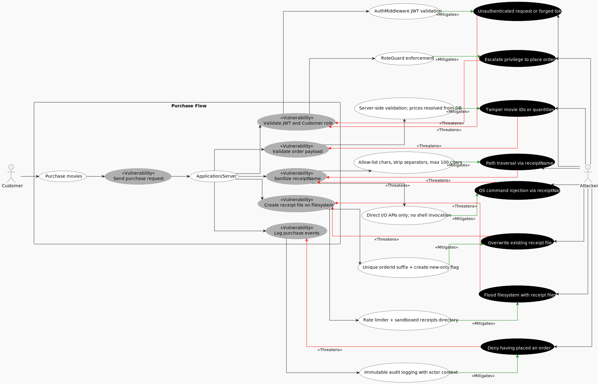
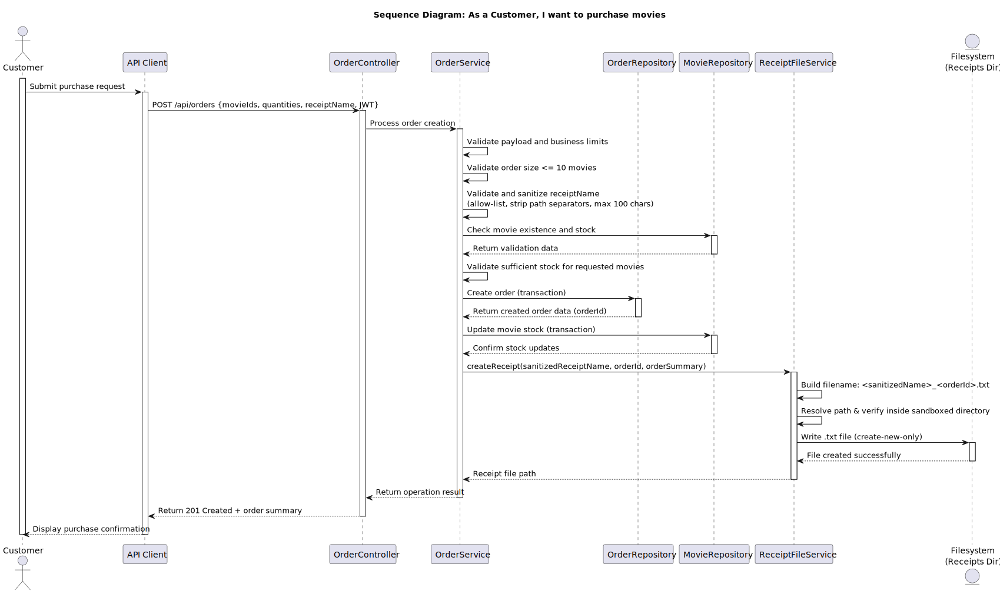

# Use Case 3: Purchase movie

## Index
- [1. Description](#1-description)
	- [1.1 Objective](#11-objective)
	- [1.2 Actors](#12-actors)
	- [1.3 Use/Abuse Case Diagram](#13-useabuse-case-diagram)
	- [1.4 Pre-conditions](#14-pre-conditions)
	- [1.5 Post-conditions](#15-post-conditions)
- [2. Interaction Flow & Architecture](#2-interaction-flow--architecture)
	- [2.1 Interaction Flow (API Level)](#21-interaction-flow-api-level)
	- [2.2 Sequence Diagram](#22-sequence-diagram)
- [3. Threat Analysis](#3-threat-analysis)
	- [3.1 STRIDE Table](#31-stride-table)
- [4. Security Requirements (ASVS Compliance)](#4-security-requirements-asvs-compliance)
- [5. Secure Development Requirements](#5-secure-development-requirements)

## 1. Description
### 1.1 Objective
This Use Case allows a user with the **Customer** role to purchase one or more available movies and provide the name that should appear on the receipt. Upon a successful purchase, the system creates a `.txt` receipt file on the server's filesystem using the name supplied by the customer (fulfilling the project requirement for **execution of OS functionalities** such as file creation). The process ensures that the order is validated, persisted consistently, and protected by the platform's authentication, authorization, and business validation rules, including strict sanitization of the customer-supplied filename to prevent path traversal and other filesystem-based attacks.

### 1.2 Actors
* **Customer:** Primary actor responsible for selecting movies and submitting the purchase request.

### 1.3 Use/Abuse Case Diagram
This section documents the expected legitimate purchase flow and the main abuse scenarios, such as unauthorized purchase attempts, tampering with order data, or attempts to bypass stock and quantity restrictions.

### 1.4 Pre-conditions
* The actor must be successfully authenticated.
* The actor must possess a valid JWT with the `Customer` role.
* The requested movie identifiers must exist in the catalog, be available for sale, and have sufficient stock.
* The request must not exceed 10 movies in a single order.
* A valid receipt name must be provided in the purchase request.

### 1.5 Post-conditions
* A new order is created and stored in the database.
* The order includes the receipt name provided by the customer.
* Stock quantities are updated according to the purchased movies.
* A `.txt` receipt file is created on the server's filesystem inside a dedicated, sandboxed receipts directory. The filename is derived from the sanitized `receiptName` provided by the customer (e.g., `<sanitized_receiptName>_<orderId>.txt`).
* The receipt file contains the order summary (order ID, movie titles, quantities, total price, and timestamp).

---

## 2. Interaction Flow & Architecture
The interaction follows a direct request-response pattern between the client and the server, with the purchase workflow enforced through secure API operations.

### 2.1 Interaction Flow (API Level)
1. **Request:** The Customer sends a `POST` request to `/api/orders` with the selected movie identifiers, quantities, and `receiptName` in the JSON body.
2. **Authorization:** The `OrderController` invokes the `RoleGuard` to confirm the actor has `Customer` privileges.
3. **Business Logic:** The `OrderController` invokes the `OrderService`, which validates the request payload (including `receiptName`), enforces the limit of at most 10 movies per order, checks movie existence, validates sufficient stock, and enforces business constraints.
4. **Filename Sanitization:** The `OrderService` sanitizes the `receiptName`,   stripping path separators, null bytes, and any characters outside an allow-list of alphanumeric characters, spaces, hyphens, and underscores,  to produce a safe filename.
5. **Persistence:** The `OrderService` creates the order via `OrderRepository` and receives the created order data (for example, `orderId`).
6. **Stock Update:** The `OrderService` updates movie stock via `MovieRepository`.
7. **Receipt File Creation (OS Operation):** The `OrderService` invokes the `ReceiptFileService`, which writes a `.txt` file to a **pre-configured, sandboxed directory** on the server filesystem. The filename follows the pattern `<sanitized_receiptName>_<orderId>.txt`. The file contains the order summary (order ID, movies, quantities, total price, timestamp).
8. **Response:** The system returns a `201 Created` response with the created order summary.

### 2.2 Sequence Diagram

---

## 3. Threat Analysis

Specific threats to the purchase workflow were evaluated using STRIDE.

### 3.1 STRIDE Table

| Threat | Category | Mitigation Strategy |
| :--- | :--- | :--- |
| Unauthenticated user attempts to create an order | **Spoofing** | Mandatory JWT verification via `AuthMiddleware` before reaching the controller. |
| Attacker modifies movie IDs or quantities in the request body (e.g., invalid IDs, negative or zero quantities) | **Tampering** | Server-side validation of all payload fields; prices are always resolved from the database and never accepted from the client. Movie IDs are verified against the catalog; quantities must be positive integers within the allowed range. |
| Customer denies having placed an order after completion | **Repudiation** | Audit logging of all purchase events with actor ID, timestamp, and request context (ASVS V16). |
| Sensitive order or user data leaked in API responses | **Information Disclosure** | DTOs filter response fields; internal IDs and stack traces are never exposed. HTTPS enforced for all communication. |
| Attacker floods `POST /api/orders` to exhaust stock or overload the system | **Denial of Service** | Rate limiting middleware on the API; atomic stock checks prevent overselling. |
| Non-Customer role (Support/Admin) attempts to create an order | **Elevation of Privilege** | `RoleGuard` enforces that only the `Customer` role can access the purchase endpoint. |
| Race condition between stock check and order creation (TOCTOU) | **Tampering** | Order creation and stock update are handled as an atomic database transaction. |
| Attacker injects path traversal sequences (e.g., `../../`) in `receiptName` to write files outside the receipts directory | **Tampering** | `receiptName` is sanitized with an allow-list (alphanumeric, spaces, hyphens, underscores); path separators and null bytes are stripped. The final path is resolved and verified to remain inside the sandboxed receipts directory. |
| Attacker crafts `receiptName` to overwrite an existing receipt file | **Tampering** | Each receipt filename includes the unique `orderId` suffix, making collisions infeasible. The service uses a create-new-only flag (e.g., `O_EXCL` / `CREATE_NEW`) to fail if the file already exists. |
| Attacker submits excessively long `receiptName` to cause buffer issues or disk abuse | **Denial of Service** | `receiptName` is limited to a maximum of 100 characters; overall receipt file size is bounded. |
| Receipt file contents expose sensitive data if server filesystem is compromised | **Information Disclosure** | Receipt files contain only non-sensitive order summary data (no passwords, tokens, or PII beyond the receipt name). File permissions are restricted to the application process owner (e.g., `600`). |
| Mass order creation to flood the filesystem with receipt files | **Denial of Service** | Rate limiting on `POST /api/orders`; periodic cleanup of old receipt files. |
| Attacker injects OS command metacharacters (e.g., `; rm -rf /`, `&& curl ...`) in `receiptName` to achieve Remote Code Execution if the filename is ever passed to a shell | **Tampering** | File operations use only direct I/O APIs (e.g., language-native file open/write), the `receiptName` is **never** interpolated into shell commands. The allow-list sanitization provides defense-in-depth by rejecting shell metacharacters (`;` `&` `\|` `$` `\` `` ` `` etc.). |

---

## 4. Security Requirements (ASVS Compliance)
Based on the ASVS 5.0 checklist, the following requirements are strictly enforced for this UC:

* **ASVS V2.2.1 and V2.2.2 (Input Validation):** All purchase payload fields, including movie identifiers, quantities, and `receiptName`, are validated against expected structure and business rules before processing.
* **ASVS V2.3.4 (Business Logic Security):** The application enforces the correct business flow for movie purchases, including stock checks, valid catalog references, and order quantity limits, so a limited stock item cannot be double-booked by manipulating application logic.
* **ASVS V2.4.1 (Anti-automation):** Purchase attempts are rate-limited to reduce abuse, scraping, and denial-of-service conditions.
* **ASVS V5.3.1 (File Handling):** Receipt files are stored outside the public web surface and are not executable as server-side code when accessed directly.
* **ASVS V5.3.2 (File Handling):** The receipt filename is derived from trusted or strictly validated data, and the resolved absolute path must remain inside the designated receipts directory to prevent path traversal, LFI, and RFI-style abuse.
* **ASVS V8.2.1 (Authorization):** Access control is enforced at the backend service layer. The server validates the JWT role for every request to the purchase endpoint.
* **ASVS V8.3.1 and V8.3.3 (Authorization):** Authorization decisions are enforced at the trusted service layer and based on the originating consumer's permissions, ensuring only authorized actors can create orders.
* **ASVS V12.1.2 and V12.3.1 (Secure Communication):** All communication between the API client, the backend, and supporting services is protected with TLS to prevent interception in transit.
* **ASVS V16.2.1 and V16.3.1 (Security Logging):** All successful and failed purchase attempts, including receipt file creation success or failure, are logged as security-relevant events with actor and request context.

---

## 5. Secure Development Requirements
* **Code Review:** Any change to the purchase workflow in `OrderController`, `OrderService`, `ReceiptFileService`, or stock management logic requires a security-focused peer review. Changes to filename sanitization logic require **explicit security sign-off**.
* **Automated Testing:** Unit and integration tests must cover valid purchases, missing/invalid `receiptName`, path traversal attempts in `receiptName` (e.g., `../../etc/passwd`, `CON`, `NUL`), excessively long names, invalid movie identifiers, insufficient stock, excessive quantity attempts, unauthorized access to the purchase endpoint, and receipt file creation on disk.
* **Filesystem Testing:** Tests must verify that receipt files are created only inside the sandboxed directory, that the file content matches the expected order summary, and that restricted characters in `receiptName` are correctly stripped.
