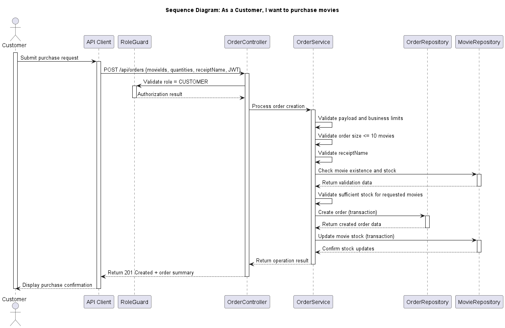

# Use Case 3: Purchase movie

## 1. Description
### 1.1 Objective
This Use Case allows a user with the **Customer** role to purchase one or more available movies and provide the name that should appear on the receipt. The process ensures that the order is validated, persisted consistently, and protected by the platform's authentication, authorization, and business validation rules.

### 1.2 Actors
* **Customer:** Primary actor responsible for selecting movies and submitting the purchase request.

### 1.3 Use/Abuse Case Diagram
This section documents the expected legitimate purchase flow and the main abuse scenarios, such as unauthorized purchase attempts, tampering with order data, or attempts to bypass stock and quantity restrictions.

### 1.4 Pre-conditions
* The actor must be successfully authenticated.
* The actor must possess a valid JWT with the `Customer` role.
* The requested movie identifiers must exist in the catalog, be available for sale, and have sufficient stock.
* The request must not exceed 10 movies in a single order.
* A valid receipt name must be provided in the purchase request.

### 1.5 Post-conditions
* A new order is created and stored in the database.
* The order includes the receipt name provided by the customer.
* Stock quantities are updated according to the purchased movies.
* A receipt is generated with the order summary and the provided receipt name.

---

## 2. Interaction Flow & Architecture
The interaction follows a direct request-response pattern between the client and the server, with the purchase workflow enforced through secure API operations.

### 2.1 Interaction Flow (API Level)
1. **Request:** The Customer sends a `POST` request to `/api/orders` with the selected movie identifiers, quantities, and `receiptName` in the JSON body.
2. **Authorization:** The `OrderController` invokes the `RoleGuard` to confirm the actor has `Customer` privileges.
3. **Business Logic:** The `OrderController` invokes the `OrderService`, which validates the request payload (including `receiptName`), enforces the limit of at most 10 movies per order, checks movie existence, validates sufficient stock, and enforces business constraints.
4. **Persistence:** The `OrderService` creates the order via `OrderRepository` and receives the created order data (for example, `orderId`).
5. **Stock Update:** The `OrderService` updates movie stock via `MovieRepository`.
6. **Response:** The system returns a `201 Created` response with the created order summary.

### 2.2 Sequence Diagram

---

## 5. Security Requirements (ASVS Compliance)
Based on the ASVS checklist, the following requirements are strictly enforced for this UC:

* **ASVS 4.1.1 (Access Control):** Access control is enforced at the backend service layer. The server validates the JWT role for every request to the purchase endpoint.
* **ASVS 5.2.2 (Validation and Sanitization):** All purchase payload fields, including movie identifiers, quantities, and `receiptName`, are validated and sanitized before processing.
* **ASVS 11.1.1 (Business Logic):** The application enforces the correct business flow for movie purchases, including stock checks, valid catalog references, and order quantity limits.
* **ASVS 11.1.6 (TOCTOU):** Order creation and stock updates are handled as atomic transactions to prevent race conditions and inconsistent purchases.
* **ASVS 7.1.3 (Logging):** All successful and failed purchase attempts are logged as security-relevant events with actor and request context.
* **ASVS 13.1.4 (Authorization):** Authorization decisions are made at both the URI level and the resource/service level, ensuring only authorized actors can create orders.

---

## 6. Secure Development Requirements
* **Code Review:** Any change to the purchase workflow in `OrderController`, `OrderService`, or stock management logic requires a security-focused peer review.
* **Automated Testing:** Unit and integration tests must cover valid purchases, missing/invalid `receiptName`, invalid movie identifiers, insufficient stock, excessive quantity attempts, and unauthorized access to the purchase endpoint.
