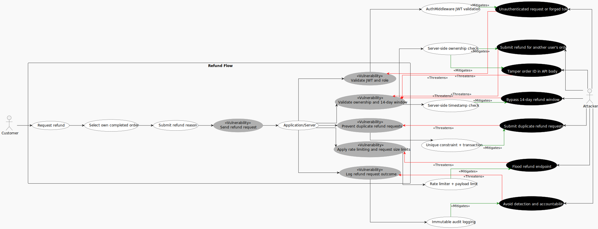
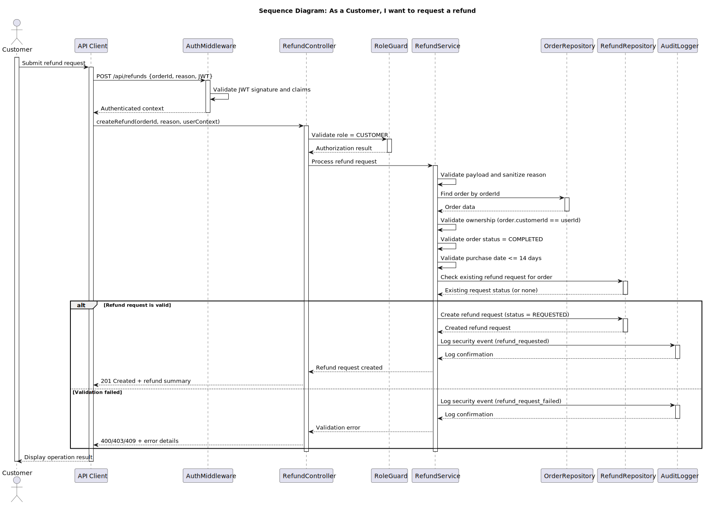

# Use Case 4: Request refund

## Index
- [1. Description](#1-description)
- [1.1 Objective](#11-objective)
- [1.2 Actors](#12-actors)
- [1.3 Use/Abuse Case Diagram](#13-useabuse-case-diagram)
- [1.4 Pre-conditions](#14-pre-conditions)
- [1.5 Post-conditions](#15-post-conditions)
- [2. Interaction Flow & Architecture](#2-interaction-flow--architecture)
- [2.1 Interaction Flow (API Level)](#21-interaction-flow-api-level)
- [2.2 Sequence Diagram](#22-sequence-diagram)
- [3. Threat Analysis](#3-threat-analysis)
- [3.1 STRIDE Table](#31-stride-table)
- [4. Security Requirements (ASVS Compliance)](#4-security-requirements-asvs-compliance)
- [5. Secure Development Requirements](#5-secure-development-requirements)

## 1. Description
### 1.1 Objective
This Use Case allows a user with the **Customer** role to request a refund for an eligible completed order by providing the order reference and a valid reason. The process ensures that refund requests are validated, persisted consistently, and protected by the platform's authentication, authorization, and business validation rules.

### 1.2 Actors
* **Customer:** Primary actor responsible for submitting the refund request.

### 1.3 Use/Abuse Case Diagram
This section documents the expected legitimate refund flow and the main abuse scenarios, such as unauthorized refund attempts, tampering with the order reference, or requests submitted outside the allowed refund window.

* The **use case flow** represents the intended behavior for a Customer submitting a refund request.
* The **abuse cases** represent attacker goals (misuse scenarios) that threaten business and security objectives.
* **Threatens** links indicate where a misuse case can compromise a step or control in the refund workflow.
* **Mitigates** links indicate which backend controls reduce the likelihood or impact of each misuse case.
* The diagram is traceable to the STRIDE analysis in Section 3 and the ASVS-aligned controls in Section 4.

### 1.4 Pre-conditions
* The actor must be successfully authenticated.
* The actor must possess a valid JWT with the `Customer` role.
* The order must exist, belong to the authenticated customer, and be in a completed state.
* The order must be within the allowed refund period of 14 days from the purchase date.
* The order must not already have an active refund request.
* A valid refund reason must be provided in the request body.

### 1.5 Post-conditions
* A new refund request is created and stored in the database.
* The refund request is linked to the original order and customer.
* The refund request is marked with the initial status `REQUESTED`.
* An audit log entry is created recording the request details and actor context.

---

## 2. Interaction Flow & Architecture
The interaction follows a direct request-response pattern between the client and the server, with the refund workflow enforced through secure API operations.

### 2.1 Interaction Flow (API Level)
1. **Request:** The Customer sends a `POST` request to `/api/refunds` with the order identifier and refund reason in the JSON body.
2. **Authorization:** The `RefundController` invokes the `RoleGuard` to confirm the actor has `Customer` privileges.
3. **Business Logic:** The `RefundController` invokes the `RefundService`, which validates the payload, checks that the order is owned by the customer, confirms that it is completed and still within the 14-day refund window, and verifies that no refund request already exists for the order.
4. **Persistence:** The `RefundService` creates the refund request through the repository layer and stores it as part of the order-related data.
5. **Logging:** The system records the request as a security-relevant event, including actor ID, order reference, and timestamp.
6. **Response:** The system returns a `201 Created` response with the created refund request summary.

### 2.2 Sequence Diagram

---

## 3. Threat Analysis

Specific threats to the refund request workflow were evaluated using STRIDE.

### 3.1 STRIDE Table

| Threat | Category | Mitigation Strategy |
| :--- | :--- | :--- |
| Unauthenticated user attempts to request a refund | **Spoofing** | Mandatory JWT verification via `AuthMiddleware` before reaching the controller. |
| Attacker modifies the order ID or refund reason in the request body | **Tampering** | Server-side validation of all payload fields; the order is always resolved from the database and checked against the authenticated customer. |
| Customer denies having submitted a refund request | **Repudiation** | Audit logging of all refund request events with actor ID, timestamp, and request context (ASVS V16). |
| Sensitive order or refund data leaked in API responses | **Information Disclosure** | DTOs filter response fields; internal IDs and stack traces are never exposed. HTTPS is enforced for all communication. |
| Attacker floods `POST /api/refunds` to overload the system | **Denial of Service** | Rate limiting middleware on the API; request size limits and duplicate-request checks reduce abuse. |
| Customer attempts to request a refund for another user's order | **Elevation of Privilege** | `RoleGuard` and ownership checks ensure only the order owner can create the refund request. |
| Refund eligibility check races with order state changes or duplicate submissions | **Tampering** | Refund validation and request creation are handled as an atomic database transaction. |

---

## 4. Security Requirements (ASVS Compliance)
Based on the ASVS checklist, the following requirements are strictly enforced for this UC:

* **ASVS V8.2.1 (Authorization):** Access control is enforced at the backend service layer. The server validates the JWT role for every request to the refund endpoint.
* **ASVS V8.3.1 (Authorization):** Authorization decisions are made at both the URI level and the resource/service level, ensuring only the customer who owns the order can create a refund request.
* **ASVS V1 (Encoding and Sanitization):** All refund payload fields, including the order identifier and refund reason, are validated and sanitized before processing.
* **ASVS V2.3.2 (Business Logic):** The application enforces the correct business flow for refund requests, including ownership checks, completed-order validation, the 14-day refund window, and duplicate-request prevention.
* **ASVS V2 (Concurrency / Consistency):** Refund eligibility validation and refund request creation are handled as an atomic transaction to prevent race conditions and inconsistent state.
* **ASVS V16.3.1 (Logging):** All successful and failed refund request attempts are logged as security-relevant events with actor and request context.
* **ASVS V14.2.1 (Data Protection):** Sensitive data, such as session tokens and order identifiers, are not exposed in the URL or query string. Tokens are passed exclusively via secure HTTP headers.

---

## 5. Secure Development Requirements
* **Code Review:** Any change to the refund workflow in `RefundController`, `RefundService`, or order validation logic requires a security-focused peer review.
* **Automated Testing:** Unit and integration tests must cover valid refund requests, missing or invalid refund reason, invalid order references, orders outside the 14-day window, orders that are not completed, duplicate refund submissions, and unauthorized access to the refund endpoint.
