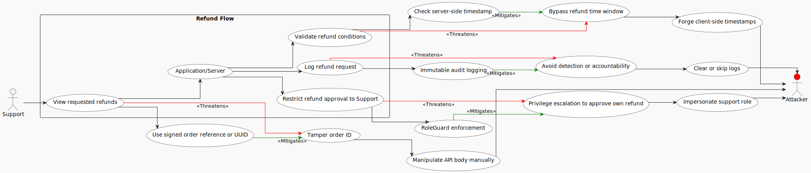
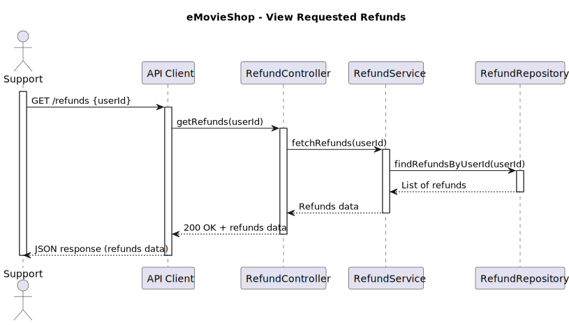

# Use Case 5: View requested refunds

## 1. Description
### 1.1 Objective
This Use Case allows users with the **Support** role to retrieve and view a list of movie refund requests submitted by customers. This ensures that refund processing is based on consistent and traceable data, providing visibility into pending requests.

### 1.2 Actors
* **Support Staff:** Primary actor responsible for monitoring and assisting with refund-related issues.

### 1.3 Use/Abuse Case Diagram
This diagram illustrates the legitimate path for retrieving the refund list versus potential abuse scenarios, such as unprivileged users attempting to access sensitive transaction data.

### 1.4 Pre-conditions
* The actor must be successfully authenticated.
* The actor must possess a valid JWT with the `Support` role.

### 1.5 Post-conditions
* The list of movie refund requests is successfully retrieved from the database.
* The information is returned to the actor in a structured JSON response.
* An audit log entry is created recording the access to the refund list data.

---

## 2. Interaction Flow & Architecture
As the system is a backend-only API, the interaction follows a direct request-response pattern between the client and the server.

### 2.1 Interaction Flow (API Level)
1. **Request:** The Actor (via API Client) sends a `GET` request to `/api/refunds` including the JWT in the Authorization header.
2. **Validation:** The `AuthMiddleware` verifies the JWT signature and the `RoleGuard` confirms the actor has Support privileges.
3. **Business Logic:** The `RefundController` invokes the `RefundService` to retrieve all movie refund records from the repository.
4. **Data Retrieval:** The system queries the database for records associated with existing and valid movie orders.
5. **Response:** The system returns a `200 OK` status with the JSON array containing the refund requests details.

### 2.2 Sequence Diagram
This diagram shows the internal backend logic and the sequence of calls between the Controller, Service, and Repository, highlighting the enforcement of security rules at the service layer.

---

## 3. Threat Analysis
Specific threats to the process of viewing refunds were evaluated using STRIDE and Attack Trees.

### 3.1 STRIDE Table
| Threat | Category | Mitigation Strategy |
| :--- | :--- | :--- |
| Unauthenticated user attempts to access the refund list | **Spoofing / Information Disclosure** | Mandatory JWT verification for the endpoint. |
| A Customer role user attempts to call the Support-only endpoint | **Elevation of Privilege** | Server-side RBAC (Role-Based Access Control) enforcement. |
| Attacker floods the API with list requests to cause a DoS | **Denial of Service** | Implementation of Rate Limiting middleware on the API. |
| Sensitive refund data is intercepted during transit | **Information Disclosure** | Enforced use of TLS (HTTPS) for all API communications (ASVS V12.3.1). |

---

## 4. Security Requirements (ASVS Compliance)
Based on the ASVS checklist, the following requirements are strictly enforced for this UC:

* **ASVS V8.2.1 and V8.3.1 (Authorization):** Function-level access to the refund list endpoint is restricted to consumers with explicit permissions, and authorization is enforced at the trusted service layer rather than in client-controlled logic. Only users with the Support role may invoke this endpoint in the current design.
* **ASVS V12.3.1 (Secure Communication):** All communication between the client and the backend API is protected with TLS so that refund data and authentication material are not exposed in transit.
* **ASVS V16.2.1, V16.3.2, and V16.3.3 (Security Logging and Error Handling):** Successful access, failed authorization attempts, and attempts to bypass security controls are logged with the required metadata, including the requested resource, required role, and actual role of the requestor.
* **ASVS V16.5.1 (Error Handling):** The API returns generic errors when access is denied or another unexpected failure occurs, without exposing sensitive internal details.

---

## 5. Secure Development Requirements
* **Code Review:** Any changes to the retrieval logic in `RefundService` or access rules in `RoleGuard` require a security-focused peer review.
* **Automated Testing:** Unit and integration tests must cover scenarios of unauthorized access (e.g., a Customer role attempting to GET the refund list) to ensure RBAC integrity.