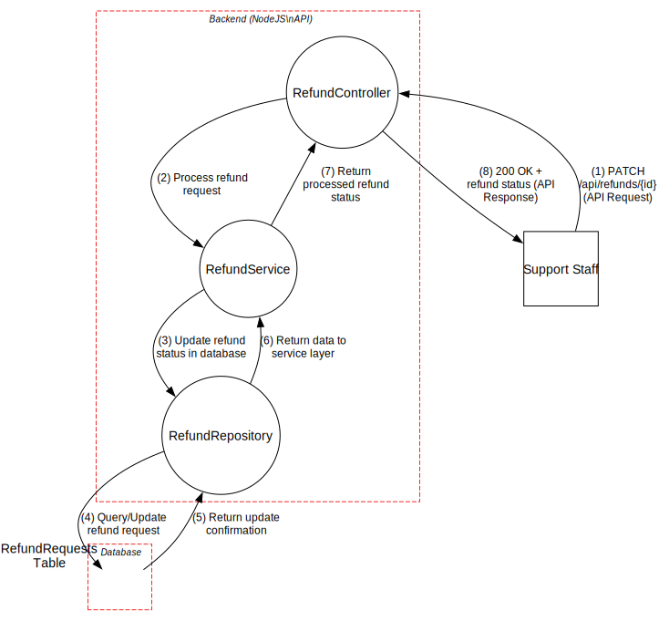

# Use Case 6: Handle Refund Request

## 1. Description
### 1.1 Objective
This Use Case allows users with the **Support** or **Admin** role to process pending movie refund requests by either approving or rejecting them. This ensures that refund processing is based on consistent and traceable data, maintaining the integrity of the platform's financial transactions.

### 1.2 Actors
* **Support Staff:** Primary actor responsible for evaluating and processing refund requests.
* **Admin:** Has full authority to handle any refund request and audit the process.

### 1.3 Use/Abuse Case Diagram
This diagram illustrates the legitimate path for handling a refund versus potential abuse scenarios, such as unauthorized users attempting to trigger or approve refunds.

### 1.4 Pre-conditions
* A valid refund request must already exist in the system (submitted via UC4 and viewed via UC5).
* The actor must be successfully authenticated.
* The actor must possess a valid JWT with the "Support" or "Admin" role.

### 1.5 Post-conditions
* The status of the refund request is updated in the database (Approved or Rejected).
* The corresponding movie order status is updated accordingly.
* An audit log entry is created recording the decision, the actor's ID, and the timestamp.

---

## 2. Interaction Flow & Architecture
As the system is a backend-only API, the interaction follows a direct request-response pattern between the client and the server.

### 2.1 Interaction Flow (API Level)
1. **Request:** The Actor sends a `PATCH` request to `/api/refunds/{id}` with the decision (status) in the JSON body.
2. **Validation:** The `AuthMiddleware` verifies the JWT signature and the `RoleGuard` confirms the actor has Support/Admin privileges.
3. **Business Logic:** The `RefundController` calls the `RefundService`, which validates if the refund request is still in a "Pending" state and linked to a valid order.
4. **Transaction:** The system atomically updates the refund status and the movie order status in the database.
5. **Response:** The system returns a `200 OK` status with the updated refund details.

### 2.2 Sequence Diagram
This diagram shows the internal backend logic and the sequence of calls between the Controller, Service, and Repository, highlighting the enforcement of security rules at the service layer.

---

## 3. Data Flow Analysis (DFD)
The DFD Level 2 illustrates how the refund decision data flows from the actor through the trust boundaries to the backend processes and finally to the database.

---

## 4. Threat Analysis
Specific threats to the refund handling process were evaluated using STRIDE and Attack Trees.

### 4.1 STRIDE Table
| Threat | Category | Mitigation Strategy |
| :--- | :--- | :--- |
| Attacker impersonates Support staff to approve own refund | **Spoofing** | Mandatory JWT verification and server-side role check. |
| Malicious user modifies the refund ID in the request | **Tampering** | Validation of the refund ID against the database records before processing. |
| Support staff denies having approved a fraudulent refund | **Non-Repudiation** | Detailed audit logging (ASVS 7.1.3) with cryptographically signed logs where applicable. |
| Customer tries to access the approval endpoint | **Elevation of Privilege** | RBAC enforced via `RoleGuard` at the controller level. |

### 4.2 Threat / Attack Tree Diagram
The following Attack Tree describes the logical paths an adversary might take to force an unauthorized refund approval, such as compromising a Support account or attempting a TOCTOU (Time-of-Check to Time-of-Use) exploit.

---

## 5. Security Requirements (ASVS Compliance)
Based on the ASVS checklist, the following requirements are strictly enforced for this UC:

* **ASVS 4.1.1 (Access Control):** All access control is enforced at the backend service layer. The server validates the JWT role for every request to the handle refund endpoint.
* **ASVS 11.1.1 (Business Logic):** The application ensures business logic flows are processed in sequential order. A refund cannot be "Handled" if it hasn't been properly "Requested" and "Validated".
* **ASVS 11.1.6 (TOCTOU):** Refund and order updates are handled as atomic transactions in the database to prevent race conditions or double-refunding.
* **ASVS 7.1.3 (Logging):** All refund decisions (approvals/rejections) are logged as security-relevant events, including the ID of the staff member who performed the action.
* **ASVS 13.1.4 (Authorization):** Authorization decisions are made at both the URI level (Controller) and the resource level (Service), ensuring the actor has permission to modify the specific refund record.

---

## 6. Secure Development Requirements
* **Code Review:** All changes to the `RefundService` logic require a security-focused peer review.
* **Automated Testing:** Unit tests must cover scenarios of unauthorized access (e.g., a Customer attempting to PATCH a refund) and invalid state transitions (e.g., approving an already rejected refund).