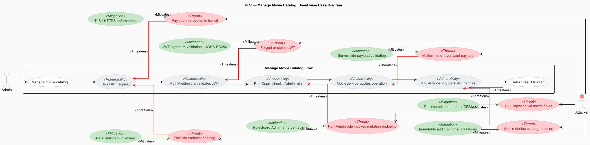

# Use Case 7: Manage Movie Catalog

## 1. Description
### 1.1 Objective
This Use Case allows an Admin to manage the eMovieShop movie catalog.
It covers two operations: retrieving the full movie catalog and performing add, edit, or remove actions on individual movies.
Admins are the only users permitted to create, edit, or remove catalog entries, enforcing strict role isolation at the API level.

### 1.2 Actors
* **Admin:** Primary actor responsible for maintaining the movie catalog.

### 1.3 Use/Abuse Case Diagram
This diagram illustrates the legitimate path for managing the movie catalog versus potential abuse scenarios, such as unprivileged 
users attempting to modify catalog data.

### 1.4 Pre-conditions
* The actor must be successfully authenticated via Auth0.
* The actor must possess a valid JWT signed with RS256, with at least 64 bits of entropy, carrying the `"Admin"` role claim.
* The JWT must not be expired (Admin sessions expire after 1 hour or 10 minutes of inactivity).

### 1.5 Post-conditions
* The movie catalog is successfully retrieved from the database, or the requested modification (add/edit/remove) is applied and confirmed.
* The result is returned to the actor in a structured JSON response.
* An audit log entry is created recording the catalog access or modification, including user ID, role, timestamp, and source IP.

---

## 2. Interaction Flow & Architecture
As the system is a backend-only API, the interaction follows a direct request-response pattern between the client and the server.

### 2.1 Interaction Flow (API Level)

**Flow 1 — Retrieve Movie Catalog:**
1. **Request:** The Admin (via API Client) sends a `GET` request to `/api/movies` including the JWT in the `Authorization: Bearer` header.
2. **Authentication:** The `AuthMiddleware` verifies the JWT signature against Auth0's JWKS endpoint using RS256. Expired or malformed tokens are rejected with `401 Unauthorized`.
3. **Authorization:** The `RoleGuard` confirms the actor holds the `Admin` role. Requests from other roles are rejected with `403 Forbidden`.
4. **Business Logic:** The `MovieController` invokes `MovieService.getMovieCatalog()` to retrieve all movie records.
5. **Data Retrieval:** The `MovieRepository` executes `findAllMovies()` and returns the full movie data set.
6. **Response:** The system returns a `200 OK` status with the JSON array containing the movie catalog.

**Flow 2 — Add / Edit / Remove a Movie:**
1. **Request:** The Admin (via API Client) sends a `POST`, `PUT`, or `DELETE` request to `/api/movies/{id}` including the JWT in the `Authorization: Bearer` header.
2. **Authentication:** The `AuthMiddleware` verifies the JWT signature against Auth0's JWKS endpoint using RS256. Expired or malformed tokens are rejected with `401 Unauthorized`.
3. **Authorization:** The `RoleGuard` confirms the actor holds the `Admin` role. Requests from other roles are rejected with `403 Forbidden`.
4. **Input Validation:** The request payload is validated server-side — movie prices must be positive and not exceed €500; titles and genres are validated for type and length constraints.
5. **Business Logic:** The `MovieController` invokes `MovieService.validateAndApplyChanges()` to apply the requested modification.
6. **Data Mutation:** The `MovieRepository` executes `save/update/deleteMovie()` and confirms the operation.
7. **Response:** The system returns `200 OK` (edit), `201 Created` (add), or `204 No Content` (delete) with a JSON response indicating success.

### 2.2 Sequence Diagram
This diagram shows the internal backend logic and the sequence of calls between the Controller, Service, and Repository, highlighting the enforcement of security rules at the service layer.

---

## 3. Threat Analysis
Specific threats to the process of managing the movie catalog were evaluated using STRIDE and Attack Trees. Threat IDs and risk scores reference the system-wide [Threat Model](../../ThreatModel/threatModel.md).

### 3.1 STRIDE Table
| Threat                                                                                                       | Category                   | Mitigation Strategy                                                                                                        |
|:-------------------------------------------------------------------------------------------------------------|:---------------------------|:---------------------------------------------------------------------------------------------------------------------------|
| Attacker uses a forged or stolen JWT to impersonate an Admin (U1, B1 — Risk 12/10)                           | **Spoofing**               | JWT signature validated against Auth0 JWKS (RS256) on every request; Admin tokens expire after 1h/10min inactivity.        |
| Non-Admin role (Customer/Support) crafts requests to invoke catalog mutation endpoints (U6, B8 — Risk 12/15) | **Elevation of Privilege** | `RoleGuard` enforces `Admin` role server-side on all mutation endpoints; `403` returned on any role mismatch.              |
| Attacker submits malformed payloads to corrupt catalog data (B3 — Risk 9)                                    | **Tampering**              | Input validation at the service layer; price capped at €500, fields validated for type and length; `400` on invalid input. |
| SQL injection via unsanitized movie fields in add/edit operations (D2 — Risk 15)                             | **Tampering**              | Parameterized queries and ORM-based repository prevent direct SQL construction from user-supplied input.                   |
| No audit trail for catalog mutations allows Admin actions to be denied (B5, D4 — Risk 12)                    | **Repudiation**            | All catalog mutations (add/edit/delete) are logged with user ID, action type, affected movie ID, timestamp, and source IP. |
| Attacker floods catalog API endpoints to cause DoS (U5, B7 — Risk 12)                                        | **Denial of Service**      | Rate limiting middleware applied to all `/api/movies` endpoints; `429` returned on threshold breach.                       |
| Catalog data or mutation payloads intercepted or tampered with in transit (U3, U4 — Risk 6/8)                | **Information Disclosure** | TLS enforced for all client-to-backend communications (ASVS V12.1.1); no plaintext fallback permitted.                     |

---

## 4. Security Requirements (ASVS Compliance)
Based on the ASVS v5.0 checklist, the following requirements are most relevant to this UC:

* **ASVS V2.2.1 — L1 (Validation and Business Logic):** Input must be validated to enforce business or functional expectations 
for each field. All payload fields for add/edit operations (title, genre, price, stock quantity) are validated server-side for type, 
format, and permitted range before reaching `MovieService`. Invalid payloads are rejected with `400 Bad Request`.

* **ASVS V2.3.2 — L2 (Validation and Business Logic):** Business logic limits must be implemented per the application's documentation. 
The service enforces the domain constraint that movie prices must be positive and must not exceed €500, and that stock quantities must 
be non-negative integers, preventing pricing errors or inventory exploits.

* **ASVS V8.2.1 — L1 (Authorization):** Function-level access must be restricted to consumers with explicit authorization. 
The `RoleGuard` enforces that only JWTs carrying the `Admin` role can invoke catalog mutation endpoints (`POST`, `PUT`, `DELETE /api/movies`). 
Requests from other roles are rejected with `403 Forbidden` at the controller layer.

* **ASVS V8.3.1 — L1 (Authorization):** Authorization rules must be enforced at a trusted service layer and not rely on client-side 
controls. The `RoleGuard` operates server-side within the `MovieService`, ensuring that catalog modification logic is never reachable 
without a valid authorization decision, regardless of client behavior.

* **ASVS V9.1.1 — L1 (Self-contained Tokens):** Self-contained tokens must be validated using their digital signature before 
any claim is trusted. The `AuthMiddleware` validates the JWT signature against Auth0's JWKS endpoint (RS256) before any claim 
such as `sub`, `role`, `exp`, or `iat` is trusted by the `MovieController` or `RoleGuard`. Expired, malformed, or unsigned tokens 
are rejected with `401 Unauthorized`.

* **ASVS V9.2.1 — L1 (Self-contained Tokens):** If a validity time span is present in the token, the token must be rejected if 
expired. Admin JWTs expire after 1 hour or 10 minutes of inactivity — the shortest expiry of any role, reflecting the elevated 
privilege level. The backend enforces the `exp` claim on every request.

* **ASVS V16.2.1 — L2 (Security Logging and Error Handling):** Each log entry must include necessary metadata such as when, where, 
who, and what. All catalog access and mutation events are logged with timestamp, Admin user ID, action type (GET/POST/PUT/DELETE), 
affected movie ID, and source IP. Failed authentication and authorization attempts are also captured. Error responses never expose 
stack traces or internal service details to the client.

---

## 5. Secure Development Requirements
* **Code Review:** Any changes to the mutation logic in `MovieService`, payload validation rules, or access rules in `RoleGuard` 
require a security-focused peer review, as defined in the project's secure development guidelines.

* **Automated Testing:** Unit and integration tests must cover:
  * Unauthenticated requests to all `/api/movies` endpoints (expect `401`).
  * Requests with a valid JWT but a non-Admin role (expect `403`).
  * Requests with malformed or expired JWTs (expect `401`).
  * Add/edit payloads with invalid data (e.g., price > €500, negative stock) (expect `400`).
  * Valid Admin requests for each operation (GET, POST, PUT, DELETE) confirming correct responses.

* **Dependency Management:** Libraries used in the movie catalog pipeline are monitored for known vulnerabilities using automated 
tooling (e.g., Snyk, OWASP Dependency-Check) as part of the CI/CD pipeline.
