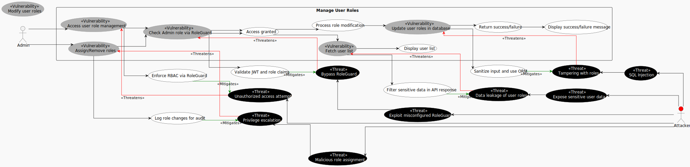
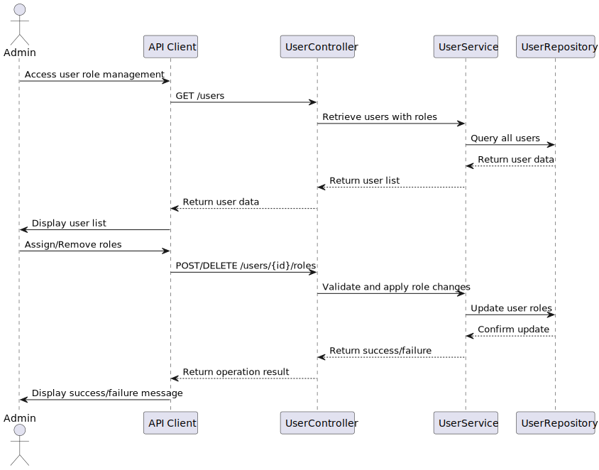

# Use Case 8: Manage User Roles

## 1. Description
### 1.1 Objective
This Use Case allows an Admin to manage user roles within the eMovie Shop system.
It enables the Admin to assign or remove roles from users, ensuring proper access control and enforcement of role-based permissions across the application.

### 1.2 Actors

* **Admin**: Primary actor responsible for managing user roles.

### 1.3 Use/Abuse Case Diagram

This diagram illustrates the legitimate flow for managing user roles, as well as potential abuse scenarios such as privilege escalation or unauthorized role modification.

### 1.4 Pre-conditions

* The actor must be successfully authenticated.
* The actor must possess a valid JWT with the "Admin" role.
* The system must have users available in the database.

### 1.5 Post-conditions

* User roles are successfully updated in the database.
* The result of the operation (success or failure) is returned in a structured JSON response.
* An audit log entry is created recording the role modification action (including actor, target user, and changes made).
* The system maintains consistent role-based access control after the update.

---

## 2. Interaction Flow & Architecture

As the system is a backend-only API, the interaction follows a direct request-response pattern between the client and the server.

### 2.1 Interaction Flow (API Level)

1. **Request (Retrieve Users)**: The Admin (via API Client) sends a `GET` request to `/api/users` including the JWT in the Authorization header.
2. **Validation**: The `AuthMiddleware` verifies the JWT and the `RoleGuard` ensures the actor has Admin privileges.
3. **Business Logic (Retrieval)**: The `UserController` invokes the `UserService` to retrieve all users along with their assigned roles.
4. **Data Retrieval**: The `UserService` queries the `UserRepository`, which fetches user data from the database.
5. **Response (User List)**: The system returns a `200 OK` status with a JSON array containing user and role information.

6. **Request (Modify Roles)**: The Admin sends a `POST` or `DELETE` request to `/api/users/{id}/roles` to assign or remove roles.
7. **Validation**: The system validates the JWT and confirms Admin privileges before allowing role modification.
8. **Business Logic (Modification)**: The `UserController` calls the `UserService` to validate and apply the requested role changes.
9. **Data Update**: The `UserService` updates the user roles via the `UserRepository`, which persists the changes in the database.
10. **Response (Operation Result)**: The system returns a success or failure response, indicating the outcome of the operation.

### 2.2 Sequence Diagram

This diagram shows the internal backend logic and the sequence of calls between the Controller, Service, and Repository in the UC8, highlighting the enforcement of security rules at the service layer.

---

## 3. Threat Analysis
Specific threats to the process of viewing refunds were evaluated using STRIDE.

### 3.1 STRIDE Table

| Threat                                                                    | Category                     | Mitigation Strategy                                                                    |
|:--------------------------------------------------------------------------|:-----------------------------|:---------------------------------------------------------------------------------------|
| Unauthorized user attempts to access role management functionality        | **Spoofing**                 | Mandatory JWT validation via authentication middleware.                                |
| Attempt to bypass `RoleGuard` due to misconfiguration                     | **Elevation of Privilege**   | Strict RBAC enforcement and centralized authorization checks (RoleGuard validation).   |
| Non-admin user attempts to assign/remove roles (*Privilege escalation*)   | **Elevation of Privilege**   | Server-side validation of role claims ensuring only Admin can modify roles.            |
| Malicious role assignment (granting excessive permissions)                | **Elevation of Privilege**   | Principle of Least Privilege and audit logging of all role modifications.              |
| Injection attack targeting role update operations (*SQL Injection*)       | **Tampering**                | Input sanitization and use of ORM/prepared statements for all database interactions.   |
| Unauthorized modification of role data in transit                         | **Tampering**                | Enforced TLS (HTTPS) for all API communications (ASVS 9.1.1).                          |
| Exposure of sensitive user-role data (*Data leakage*)                     | **Information Disclosure**   | Filtered API responses and restriction of endpoints to Admin മാത്രം users.             |
| Lack of traceability of role changes                                      | **Repudiation**              | Audit logging including actor identity, target user, and performed changes.            |
| API flooding targeting role management endpoints                          | **Denial of Service**        | Rate limiting and request throttling on sensitive endpoints.                           |

---

## 4. Security Requirements (ASVS Compliance)
Based on the ASVS checklist, the following requirements are enforced for the Manage User Roles use case:

* **ASVS V8.2.1 (Authorization)**: All role management operations are enforced at the backend service layer. The system validates the JWT and confirms the Admin role for every request to user management endpoints (e.g., /users and /users/{id}/roles), ensuring client-side controls cannot be bypassed.
* **ASVS V8.3.1 (Authorization)**: Authorization is enforced at the operation level (Controller/Endpoint). The system ensures that only users with the Admin role are explicitly permitted to assign, remove, or modify user roles via the RoleGuard mechanism.
* **ASVS V14.2.1 (Data Protection)**: Sensitive authentication data (JWTs) are transmitted exclusively via secure HTTP headers (Authorization: Bearer token). No credentials or tokens are exposed in URLs, query parameters, or logs.
* **ASVS V2.3.2 (Business Logic)**: Role assignment and modification follow strict business rules. Only predefined roles can be assigned, and only Admin users are allowed to perform role changes. Unauthorized or inconsistent role states are rejected at service level.
* **ASVS V5.3.2 (Input Validation)**: All inputs related to role updates (user IDs, role identifiers) are validated and sanitised. The system rejects malformed or unexpected role values to prevent injection or logic manipulation.
* **ASVS V16.3.1 (Logging)**: All security-relevant events are logged, including successful and failed attempts to retrieve users or modify roles. Logs include timestamps, actor ID, target user ID, and operation type to support auditing and forensic analysis.
* **ASVS V12.1.1 (Error Handling & Injection Resistance)**: The system uses ORM-based persistence and parameterized queries to prevent injection attacks (e.g., SQL injection) during role update operations.

---

## 5. Secure Development Requirements