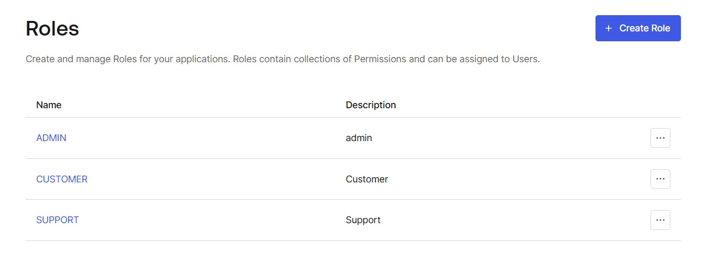
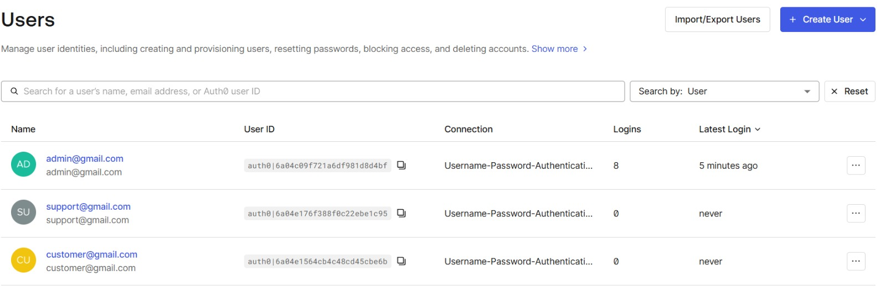
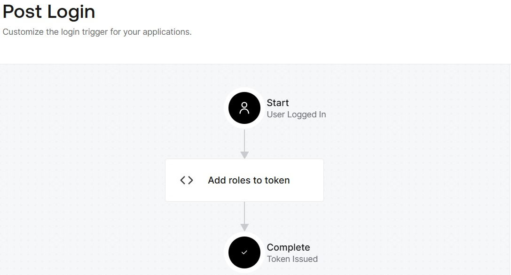
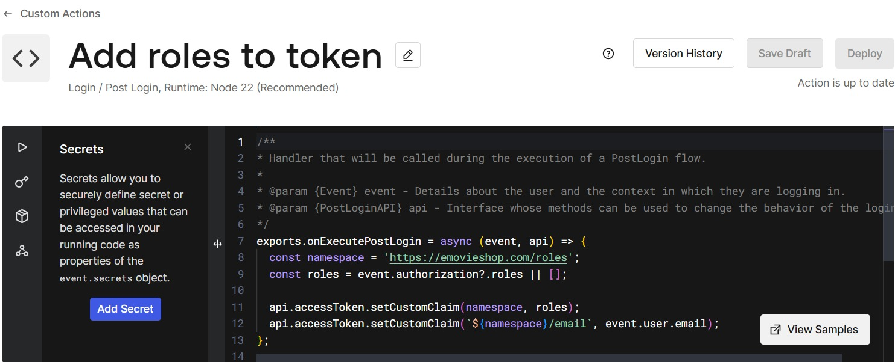
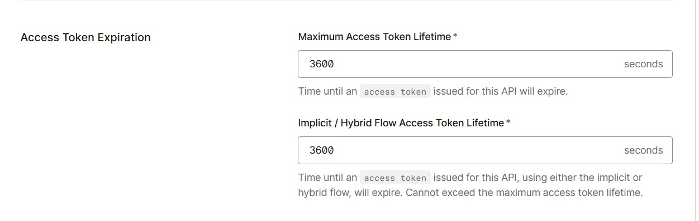
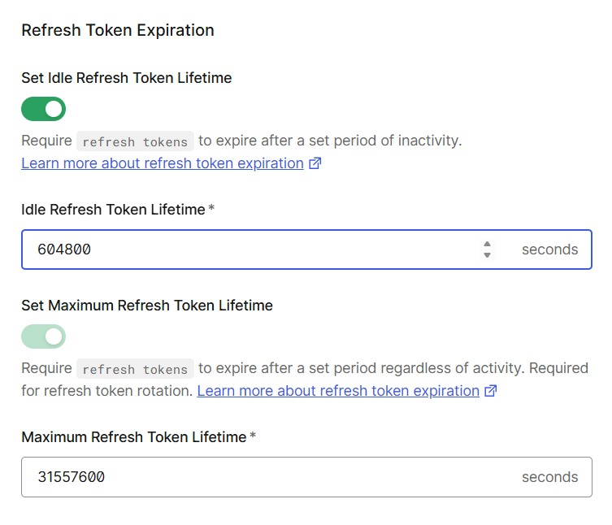
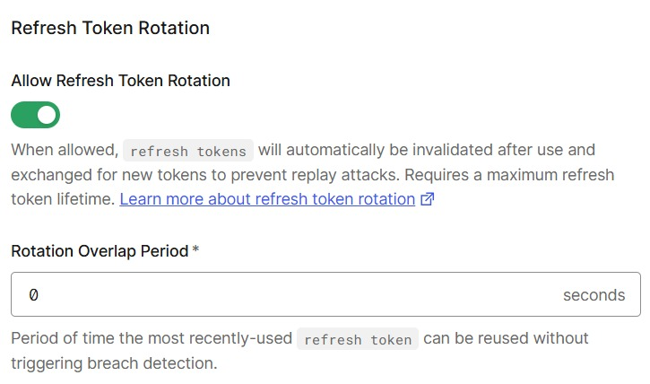
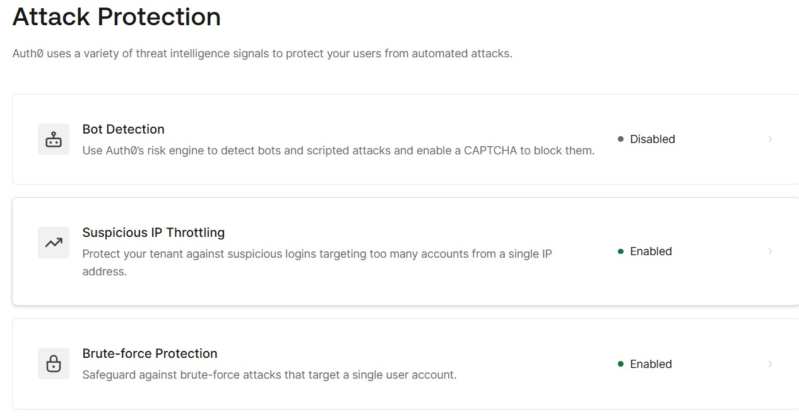

# Development - Phase 2, Sprint 1

## Table of Contents

1. [Technology Stack](#1-technology-stack)
2. [Authentication & JWT Validation](#2-authentication--jwt-validation)
3. [Auth0 Configuration](#3-auth0-configuration)
4. [Role-Based Access Control (RBAC)](#4-role-based-access-control-rbac)
5. [Data Transfer Objects (DTOs)](#5-data-transfer-objects-dtos)
6. [Input Validation & Sanitization](#6-input-validation--sanitization)
7. [Rate Limiting & DoS Protection](#7-rate-limiting--dos-protection)
8. [Security HTTP Headers](#8-security-http-headers)
9. [Audit Logging](#9-audit-logging)

---

## 1. Technology Stack

| Layer | Technology |
|---|---|
| Language | Java 21 |
| Framework | Spring Boot 3.4.5 |
| Auth / Identity | Auth0 (external IdP) - JWT RS256 |
| Database | MySQL (production), H2 (tests) |
| ORM | Spring Data JPA / Hibernate |
| Rate Limiting | Bucket4j 8.10.1 (token-bucket algorithm) |
| Build | Maven |
| SAST | CodeQL (GitHub), SpotBugs + FindSecBugs, PMD |
| SCA | OWASP Dependency-Check 11.1.1 |
| DAST | TODO |
| IAST | TODO |
| Coverage | JaCoCo 0.8.12 |
| Testing | JUnit 5, Mockito, AssertJ, Spring Security Test |

---

## 2. Authentication & JWT Validation

**Location:** `App/src/main/java/com/example/desofs/config/SecurityConfig.java`

The application is a **stateless OAuth2 Resource Server**. It never handles passwords, authentication is fully delegated to **Auth0**.

### How it works

- Every request must carry a **Bearer JWT** in the `Authorization` header.
- Spring Security validates the token signature against Auth0's JWKS endpoint.
- A custom `AudienceValidator` additionally verifies the JWT `aud` claim matches `emovieshop-api`, preventing token reuse from other Auth0 applications.
- Sessions are **stateless** (`SessionCreationPolicy.STATELESS`), no server-side session is ever created.
- CSRF protection is disabled (correct for a stateless JWT API, no cookies, no session).

```java
// Audience validation on top of issuer validation
OAuth2TokenValidator<Jwt> audienceValidator = new AudienceValidator(audience);
OAuth2TokenValidator<Jwt> issuerValidator = JwtValidators.createDefaultWithIssuer(issuerUri);
jwtDecoder.setJwtValidator(new DelegatingOAuth2TokenValidator<>(issuerValidator, audienceValidator));
```

### Public endpoints

| Endpoint | Reason |
|---|---|
| `GET /actuator/health` | Health checks from load balancers/orchestrators |

All other endpoints require a valid JWT.

---

## 3. Auth0 Configuration

Auth0 is the external Identity Provider (IdP) for eMovieShop. The following settings were configured in the Auth0 dashboard.

### 3.1 Roles

Three roles (`ADMIN`, `CUSTOMER`, `SUPPORT`) are defined in Auth0, each with a corresponding test user.





### 3.2 Post Login Action-Add Roles to Token

A **Post Login** custom action injects the user's Auth0 roles into the JWT under the namespace `https://emovieshop.com/roles`, and also attaches the user's email. The backend reads this claim in `RoleGuard` to enforce access control.





### 3.3 Token Lifetimes

Access token lifetime is set to **3600 s (1 hour)** for all flows.



Refresh tokens expire after **7 days of inactivity** (idle) with an absolute maximum of **~1 year**.



### 3.4 Refresh Token Rotation

Refresh tokens are **rotated on every use** with a 0 s overlap period-the old token is immediately invalidated, preventing replay attacks.



### 3.5 Attack Protection

Suspicious IP Throttling and Brute-force Protection are **enabled**. Bot Detection is disabled.

> **Note:** Bot detection (Auth0 Bot Detection feature) is **not activated** in this project. This feature requires a paid Auth0 plan and is therefore out of scope for this implementation. Controls related to automated attack mitigation that depend on bot detection remain unimplemented at the Auth0 level; brute-force protection (account lockout after 10 failed attempts) is still enforced via Auth0's free-tier Brute Force Protection.



---

## 4. Role-Based Access Control (RBAC)

**Location:** `App/src/main/java/com/example/desofs/security/RoleGuard.java`

### Roles

| Role | Permissions |
|---|---|
| `CUSTOMER` | Create orders, request refunds |
| `SUPPORT` | View and process refund requests |
| `ADMIN` | Manage users, assign/remove roles, view audit logs |

### RoleGuard Pattern

Rather than using Spring's `@PreAuthorize`, controllers inject `RoleGuard` as a constructor dependency and call `requireRole(jwt, role)` explicitly at the start of each protected method. This makes the access control decision visible in the controller code and testable in isolation.

```java
@Component
public class RoleGuard {
    public void requireRole(Jwt jwt, Role requiredRole) {
        List<String> roles = jwt.getClaimAsStringList(rolesClaimNamespace);
        if (roles == null || !roles.contains(requiredRole.name())) {
            throw new AccessDeniedException("Access denied. Required role: " + requiredRole.name());
        }
    }
}
```

Roles are carried in a **custom Auth0 claim** namespaced as `https://emovieshop.com/roles` to avoid collision with standard JWT claims.

### Controller Access Matrix

| Controller | Endpoint | Required Role |
|---|---|---|
| `MovieController` | `GET /api/movies` | Any authenticated user |
| `MovieController` | `GET /api/movies/{id}` | Any authenticated user |
| `MovieController` | `POST /api/movies` | Any authenticated user |
| `OrderController` | `POST /api/orders` | `CUSTOMER` |
| `RefundController` | `POST /api/refunds` | `CUSTOMER` |
| `RefundController` | `GET /api/refunds` | Any authenticated user |
| `UserController` | `GET /api/users` | `ADMIN` |
| `UserController` | `POST /api/users/{id}/roles/assign` | `ADMIN` |
| `UserController` | `DELETE /api/users/{id}/roles/remove` | `ADMIN` |
| `AuditLogController` | `GET /api/audit-logs` | `ADMIN` |
| `AuditLogController` | `GET /api/audit-logs/{id}` | `ADMIN` |

---

## 5. Data Transfer Objects (DTOs)

**Location:** `App/src/main/java/com/example/desofs/shared/dtos/`

DTOs decouple the API surface from domain entities, preventing mass assignment vulnerabilities and controlling exactly what fields are exposed.

| DTO | Purpose |
|---|---|
| `PurchaseRequestDTO` | Incoming order creation payload |
| `PurchaseItemDTO` | Individual item in a purchase request |
| `OrderResponseDTO` | Order confirmation returned to client |
| `OrderItemResponseDTO` | Item detail in order response |
| `RefundRequestDTO` | Refund request representation |
| `CreateRefundRequest` | Incoming refund creation payload |
| `RejectRefundRequest` | Payload for refund rejection with reason |
| `UserDTO` | Safe user representation for admin endpoints |
| `RoleRequestDTO` | Role assignment/removal payload |
| `MovieDTO` | Movie representation |

---

## 6. Input Validation & Sanitization

Input security uses two complementary layers:

### 6.1 Input Validation (Bean Validation / Jakarta)

**Location:** all controller methods and DTOs in `App/src/main/java/com/example/desofs/shared/dtos/`

`@Valid` annotations on controller parameters trigger declarative constraint checking before business logic runs. Malformed requests are rejected with `400 Bad Request` before reaching the service layer.

### 6.2 Input Sanitization (Receipt File Service & Path Traversal Protection)

**Location:** `App/src/main/java/com/example/desofs/services/ReceiptFileService.java`

When an order is created, a receipt file is written to a sandboxed directory. The service protects against file system attacks through:

1. **Allow-list sanitization** - strips all characters outside `[a-zA-Z0-9 _-]`
2. **Maximum name length** - enforced before file creation (default 100 chars)
3. **Path canonicalization** - the resolved output path is verified to remain inside the configured receipts directory, blocking `../` traversal even after URL-decoding
4. **Dedicated sandbox directory** - receipts are never written outside the configured base path

The `ReceiptFileService.sanitizeReceiptName()` applies a **multi-step allow-list pipeline** to every receipt name before it is used as a filesystem filename. The steps run in order:

#### Step 1 - Null byte stripping

```java
sanitized = rawName.replace("\0", "");
```

Null bytes (`\0`) can trick OS-level filename parsing. For example, `receipt.txt\0.jpg` may be interpreted as `receipt.txt` by the JVM but as `receipt.txt\0.jpg` by the underlying C library. Stripping them first prevents this class of injection entirely.

#### Step 2 - Allow-list character filter

```java
private static final String ALLOWED_CHARS_PATTERN = "[^a-zA-Z0-9 _-]";
sanitized = sanitized.replaceAll(ALLOWED_CHARS_PATTERN, "");
```

Only characters in `[a-zA-Z0-9 _-]` survive. Every character outside this set is **stripped**, not escaped. This is a deny-by-default approach: anything not explicitly allowed is removed. The table below shows the threat categories blocked by this single rule:

| Blocked character class | Examples | Threat mitigated |
|---|---|---|
| Path separators | `/`, `\`, `:` | Path traversal (`../receipts/../etc/passwd`) |
| URL-encoded traversal | `%2F`, `%2E%2E` | Double-encoded path traversal |
| Shell metacharacters | `;`, `|`, `&`, `` ` ``, `$`, `(`, `)` | OS command injection via filename |
| Glob / wildcard | `*`, `?`, `[`, `]` | Filesystem glob expansion |
| Null-byte remnants | `%00` literals | Secondary null-byte injection |
| XML / HTML special chars | `<`, `>`, `"`, `'` | Reflected XSS in receipt listings / log injection |
| Dot sequences | `..` (both dots stripped individually) | Residual traversal after decoding |
| Unicode homoglyphs & control chars | U+202E (RTL override), U+0000–U+001F | Filename spoofing, log poisoning |

#### Step 3 - Whitespace trim

```java
sanitized = sanitized.trim();
```

Prevents names composed entirely of spaces passing through to the filesystem.

#### Step 4 - Length truncation

```java
if (sanitized.length() > maxNameLength) {   // default: 100
    sanitized = sanitized.substring(0, maxNameLength);
}
```

Caps the filename at 100 characters (configurable via `emovieshop.receipts.max-name-length`). This guards against:
- **Filesystem limits** - most filesystems cap filenames at 255 bytes; staying well below avoids edge cases with multi-byte characters.
- **Log injection via long strings** - overly long filenames can corrupt structured log parsers.

#### Step 5 - Post-sanitization blank guard

```java
if (sanitized.isBlank()) {
    throw new IllegalArgumentException("Receipt name contains no valid characters after sanitization");
}
```

If all characters were stripped (e.g., input was `"../../"` or `";;;"`), the request is rejected with a `400 Bad Request` rather than creating a file with an empty or auto-generated name silently.

---

## 7. Rate Limiting & DoS Protection

**Location:** `App/src/main/java/com/example/desofs/security/RateLimitFilter.java`

Rate limiting is implemented as a **servlet filter** using the **token-bucket algorithm** (Bucket4j 8.10.1). It is registered in the Spring Security filter chain immediately after JWT authentication, so the authenticated user identity is available for per-user limits.

### Two independent limits applied per request

| Layer | Key | Default limit |
|---|---|---|
| Per-IP | `X-Forwarded-For` / remote address | 300 req/min |
| Per-user | JWT `sub` claim | 120 req/min |

When either limit is exceeded, the filter returns **HTTP 429 Too Many Requests** and logs a warning with the IP or user ID, without exposing internal details to the client.

Both limits are configurable via `application.properties`:

```properties
emovieshop.rate-limit.ip.requests-per-minute=300
emovieshop.rate-limit.user.requests-per-minute=120
```

---

## 8. Security HTTP Headers

**Location:** `App/src/main/java/com/example/desofs/security/SecurityHeadersFilter.java`

Every response includes the following security headers:

| Header | Value | Protection |
|---|---|---|
| `X-Content-Type-Options` | `nosniff` | MIME-type sniffing |
| `X-Frame-Options` | `DENY` | Clickjacking |
| `Strict-Transport-Security` | `max-age=31536000; includeSubDomains` | SSL stripping |
| `Content-Security-Policy` | `default-src 'self'; frame-ancestors 'none'` | XSS / framing |
| `X-XSS-Protection` | `1; mode=block` | Reflected XSS (legacy browsers) |
| `Referrer-Policy` | `no-referrer` | Referrer leakage |

These are also configured at the Spring Security `HttpSecurity` level (HSTS, frame options, content-type options), providing defence-in-depth.

---

## 9. Audit Logging

**Location:** `App/src/main/java/com/example/desofs/domain/AuditLog.java`, `App/src/main/java/com/example/desofs/services/AuditLogService.java`

Security-sensitive administrative operations are persisted to a dedicated `audit_logs` database table. This supports ASVS V16 (Security Logging) requirements.

### What is logged

| Event | Logged fields |
|---|---|
| Role assigned to user | `actorId`, `targetUserId`, `role`, `operation=ASSIGN`, `timestamp` |
| Role removed from user | `actorId`, `targetUserId`, `role`, `operation=REMOVE`, `timestamp` |

The `id` field has no public setter, it is assigned only by JPA after persistence, preventing audit record tampering.

### Querying audit logs

`GET /api/audit-logs`, restricted to `ADMIN` role, returns the full audit trail.

> **Known gap (TODO):** Phase 1 documentation also mandates logging for refund decisions and catalog edits. This is not yet implemented.
