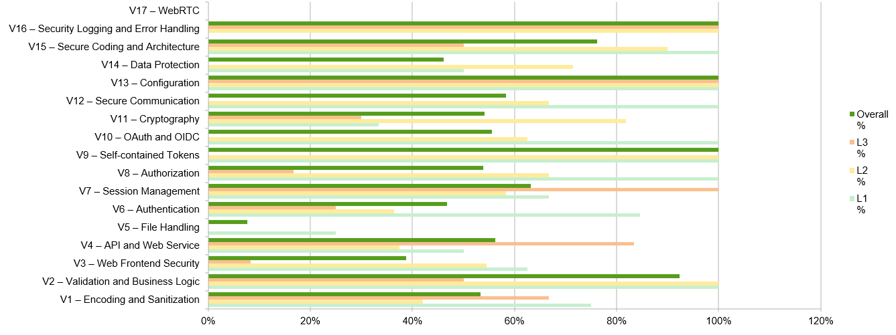
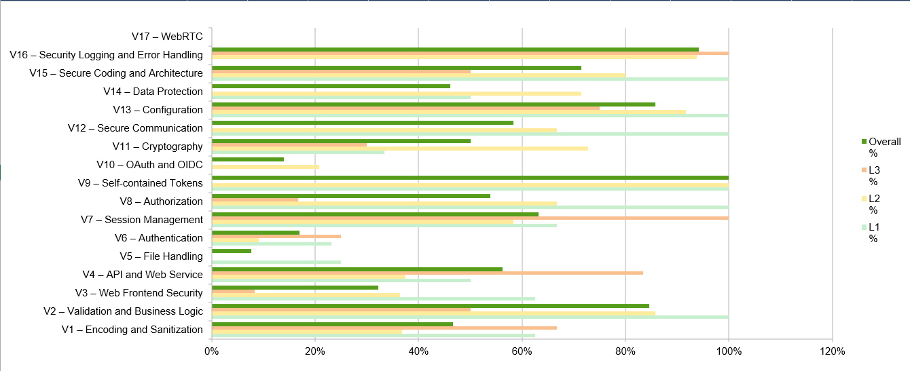
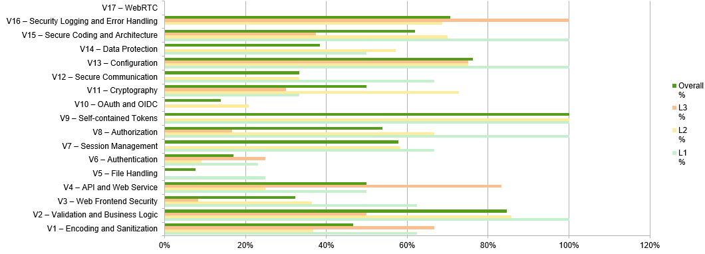

# OWASP ASVS 5.0 Assessment Evolution

This document summarizes how the project's compliance with **OWASP ASVS 5.0** evolved across three iterations: **Phase 1**, **Phase 2 - Sprint 1**, and **Phase 2 - Sprint 2**. The goal is to compare the ASVS assessment results obtained in each iteration and analyze how the project's security posture changed throughout the development lifecycle.

> **Per-control traceability.** The full requirement-by-requirement traceability for Sprint 2 (status, justification, evidence and test references for every ASVS 5.0 control) is maintained in the companion spreadsheet [`ASVS_5.0_Tracker.xlsx`](./ASVS_5.0_Tracker.xlsx). The Markdown documents in this folder summarize and compare those results; they do not duplicate the per-control rows. Sprint 1 keeps a Markdown traceability document at [`Sprint1/ASVSTraceability/Traceability.md`](../../Sprint1/ASVSTraceability/Traceability.md), which remains the baseline for any control whose status was unchanged in Sprint 2.

## Table of Contents

1. [Phase 1 Baseline](#phase-1-baseline)
2. [Phase 2 Sprint 1](#phase-2-sprint-1)
3. [Phase 2 Sprint 2](#phase-2-sprint-2)
4. [Comparative Analysis](#comparative-analysis)
5. [Compliance Summary](#compliance-summary)

---

## Phase 1 Baseline

Phase 1 established the initial security baseline of the project. It focused on requirements elicitation, architectural design, threat identification, and the definition of the security controls that would guide the implementation phase.

The strongest areas at this stage were:

- V2 - Validation and Business Logic
- V4 - API and Web Service
- V7 - Session Management
- V9 - Self-contained Tokens
- V13 - Configuration
- V16 - Security Logging and Error Handling

These categories achieved relatively high coverage thanks to the architectural decisions, security requirements, and controls identified during the design phase.

Figure 1 shows the coverage percentage achieved for each ASVS chapter and level during Phase 1.

---

## Phase 2 Sprint 1

Phase 2 Sprint 1 marked the transition from design to implementation. The team focused on delivering the core application features and the security controls identified during Phase 1.

The strongest areas at this stage were:

- V2 - Validation and Business Logic
- V4 - API and Web Service
- V9 - Self-contained Tokens
- V13 - Configuration
- V16 - Security Logging and Error Handling

Although several security mechanisms were already implemented, the assessment process became more implementation-driven: requirements were evaluated against the functionality actually present in the application rather than against planned or architectural controls alone.

Figure 2 shows the coverage percentage achieved for each ASVS chapter and level during Phase 2 - Sprint 1.

---

## Phase 2 Sprint 2

Phase 2 Sprint 2 was the final development iteration and the last ASVS assessment performed within the scope of the project.

The strongest areas at this stage were:

- V2 - Validation and Business Logic
- V9 - Self-contained Tokens
- V13 - Configuration
- V16 - Security Logging and Error Handling

In this sprint the ASVS checklist was reviewed in greater detail and validated against the final implementation. The reassessment produced a more accurate view of the security controls effectively implemented, documented, and demonstrable within the project's scope.

Figure 3 shows the coverage percentage achieved for each ASVS chapter and level during Phase 2 - Sprint 2.

---

## Comparative Analysis

Table 1 compares the ASVS coverage percentages obtained in each assessment.

|**Category**|**Phase 1**|**Phase 2 - Sprint 1**|**Phase 2 - Sprint 2**|
|:----------:|:---------:|:--------------------:|:--------------------:|
| V1 – Encoding and Sanitization | 53% | 47% | 47% |
| V2 – Validation and Business Logic | 92% | 85% | 85% |
| V3 – Web Frontend Security | 39% | 32% | 32% |
| V4 – API and Web Service | 56% | 56% | 50% |
| V5 – File Handling | 8% | 8% | 8% |
| V6 – Authentication | 47% | 17% | 17% |
| V7 – Session Management | 63% | 63% | 58% |
| V8 – Authorization | 54% | 54% | 54% |
| V9 – Self-contained Tokens | 100% | 100% | 100% |
| V10 – OAuth and OIDC | 56% | 14% | 14% |
| V11 – Cryptography | 54% | 50% | 50% |
| V12 – Secure Communication | 58% | 58% | 33% |
| V13 – Configuration | 100% | 86% | 76% |
| V14 – Data Protection | 46% | 46% | 38% |
| V15 – Secure Coding and Architecture | 76% | 71% | 62% |
| V16 – Security Logging and Error Handling | 100% | 94% | 71% |
| V17 - WebRTC | 0% | 0% | 0% |

Several categories remained stable across all assessments, particularly V5 (File Handling), V8 (Authorization), V9 (Self-contained Tokens), and V17 (WebRTC).

Other categories show lower coverage values in later assessments. This is mainly explained by the progressive refinement of the assessment process: as implementation advanced, requirements were reassessed against concrete evidence and some controls were reclassified as partially implemented, not implemented, or out of scope.

The most noticeable reductions occurred in Authentication (V6), OAuth and OIDC (V10), Configuration (V13), and Security Logging and Error Handling (V16). These reflect a more rigorous interpretation of ASVS requirements rather than the removal of existing security controls.

Session Management (V7) deserves a specific note: requirement V7.4.1 (server-side invalidation of self-contained tokens) was promoted from `Partial` to `Compliant` in Sprint 2 thanks to the UC8 token denylist (`TokenInvalidationService` + `TokenFreshnessFilter`). The 5 percentage-point net decrease (63% → 58%) results from other V7 controls (notably session timeout, idle re-authentication and concurrent-session controls) being reclassified downwards once they were re-evaluated against the actual implementation rather than against the architectural intent recorded in Phase 1.

---

## Compliance Summary

The three ASVS assessments showed the importance of continuously validating security requirements throughout the software development lifecycle.

Although some categories show lower compliance percentages in later iterations, the results should not be interpreted as a deterioration of the application's security posture. They reflect the increasing accuracy and maturity of the assessment process as implementation progressed.

Throughout the project, security controls were implemented incrementally and reassessed against the actual state of the application. This produced a more evidence-based evaluation, in which only controls that could be effectively demonstrated and verified were considered compliant.

Some requirements were intentionally left unimplemented due to project constraints; others were determined to be out of scope for the chosen architecture and business requirements. Consequently, the final assessment is the most realistic representation of the application's compliance with OWASP ASVS 5.0.

Overall, the repeated use of ASVS throughout the project enabled systematic security validation, improved traceability between requirements and implementation, and helped identify areas requiring further security investment beyond the project's available timeframe.