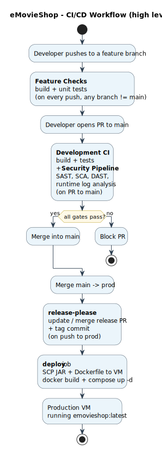

# Pipeline Automation - Phase 2, Sprint 2

This document records the **Sprint 2 deltas** on top of the pipelines defined in [Sprint 1 Pipeline Automation](../../Sprint1/PipelineAutomation/pipelineAutomation.md). The branching strategy, development workflow, security workflow (CodeQL, Dependency-Check + SBOM, OWASP ZAP, runtime log analysis) and `release-please` are unchanged.

## Table of Contents

1. [Sprint 2 Scope](#1-sprint-2-scope)
2. [Security Pipeline Updates](#2-security-pipeline-updates)
3. [Deployment Pipeline](#3-deployment-pipeline)
4. [Secrets and Variables - Compliance Statement](#4-secrets-and-variables--compliance-statement)

---

## 1. Sprint 2 Scope



| Area | Sprint 2 delta |
|---|---|
| Build / Feature checks | No change |
| Development workflow | No change |
| Security pipeline (`security.yml`) | UC5-UC8 endpoints now in the OpenAPI surface scanned by ZAP; Auth0 Management env exported to the application under test |
| Release pipeline (`release-please.yml`) | New `deploy` job that ships the JAR + container stack to the production VM after each release to `prod` |

The pre-existing SAST/SCA/DAST workflow ([`.github/workflows/security.yml`](../../../../.github/workflows/security.yml)) is left intact; CodeQL, SpotBugs/PMD, OWASP Dependency-Check and OWASP ZAP keep running with the same gates, with the ZAP API scan remaining blocking (`fail_action: true`).

---

## 2. Security Pipeline Updates

The OpenAPI spec served by `/v3/api-docs` now includes the UC5, UC6, UC7 and UC8 endpoints (refund listing, refund approval/rejection, full movie CRUD, user / role administration). ZAP automatically picks them up via OpenAPI-driven scanning, so no workflow change was required to broaden coverage.

The DAST job now also exports the Auth0 Management variables required by UC8 (`AUTH0_MGMT_*` and the role IDs) so the integration tests can exercise role assignment and session revocation end-to-end. The same M2M application used by ZAP serves the backend Management API calls; the `delete:sessions` scope was added to its allow-list.

The ZAP suppression list in `rules.tsv` is unchanged from Sprint 1 (see [Cap4.2](../../Sprint1/PipelineAutomation/pipelineAutomation.md#42-dast-job-owasp-zap)).

The runtime log analysis step (the IAST pragmatic alternative) keeps running as part of the same job, now exercising the new `TokenFreshnessFilter` and `Auth0ManagementClient` log patterns; see [Testing & Validation Cap4.4](../TestingAndValidation/testingAndValidation.md#44-iast-alternative---runtime-log-analysis).

---

## 3. Deployment Pipeline

**Workflow file:** [`.github/workflows/release-please.yml`](../../../../.github/workflows/release-please.yml).

**Trigger:** push to `prod`. The first job (`release-please`) keeps a release PR up-to-date and tags the commit on merge. The second job (`deploy`) ships the application to the production VM after each release.

**Steps:**

| Step | Tool | Purpose |
|---|---|---|
| Checkout | Git | Fetch source code |
| Setup JDK 21 | Temurin + Maven cache | Build environment |
| `mvn -B clean package -DskipTests` | Maven | Build the runtime JAR |
| Stage artefacts | shell | Copy `App/Dockerfile`, `App/docker-compose.yml` and the JAR under `deploy/` |
| Upload to VM | `appleboy/scp-action` | Transfer `deploy/` to `/opt/emovieshop/deploy` |
| Remote deploy | `appleboy/ssh-action` | Build the image and bring the stack up |

The upload step uses `appleboy/scp-action` and only references secrets:

```yaml
- uses: appleboy/scp-action@v0.1.7
  with:
    host: ${{ secrets.VM_HOST }}
    username: ${{ secrets.VM_USER }}
    key: ${{ secrets.VM_SSH_KEY }}
    source: deploy/
    target: /opt/emovieshop/
```

The remote deploy step then uses `appleboy/ssh-action` and exposes database credentials only inside the SSH session, via the action's `envs:` clause (no secret is written to the VM filesystem):

```yaml
- uses: appleboy/ssh-action@v1
  env:
    DB_HOST: ${{ secrets.DB_HOST }}
    DB_PORT: ${{ secrets.DB_PORT }}
    DB_NAME: ${{ secrets.DB_NAME }}
    DB_USERNAME: ${{ secrets.DB_USERNAME }}
    DB_PASSWORD: ${{ secrets.DB_PASSWORD }}
  with:
    host: ${{ secrets.VM_HOST }}
    username: ${{ secrets.VM_USER }}
    key: ${{ secrets.VM_SSH_KEY }}
    envs: DB_HOST,DB_PORT,DB_NAME,DB_USERNAME,DB_PASSWORD
    script: |
      mkdir -p /opt/emovieshop/receipts
      docker build -t emovieshop:latest /opt/emovieshop/deploy
      cd /opt/emovieshop/deploy
      docker compose up -d
      docker image prune -f
```

The production stack uses the same hardened [`App/docker-compose.yml`](../../../../App/docker-compose.yml) as local development (`security_opt: no-new-privileges:true`, `cap_drop: ALL`, `restart: unless-stopped`, healthcheck). The compose file exposes only port 8080 and runs the container as the non-root user `emovieshop` (see [`App/Dockerfile`](../../../../App/Dockerfile)); detailed hardening rationale lives in [Security Configuration & Installation](../SecurityConfigurationAndInstallation/securityConfigurationAndInstallation.md).

---

## 4. Secrets and Variables - Compliance Statement

The deploy job follows the same GitHub Secrets practices already in place for the Sprint 1 workflows: sensitive values are not committed to source control, secrets are referenced via `${{ secrets.NAME }}`, outputs that may contain secrets are masked with `::add-mask::`, and repository variables are used for non-sensitive configuration only.

Sprint 2 added the following secrets to support deployment, all referenced exclusively by `release-please.yml`: `VM_HOST`, `VM_USER`, `VM_SSH_KEY`, `DB_HOST`, `DB_PORT`, `DB_NAME`, `DB_USERNAME`, `DB_PASSWORD`. The Auth0 secrets already in place for the security pipeline (`AUTH0_DOMAIN`, `AUTH0_CLIENT_ID`, `AUTH0_CLIENT_SECRET`, role IDs) are reused at deploy time. No deployment-time value is committed to the repository, embedded in the image, or echoed in workflow logs.
