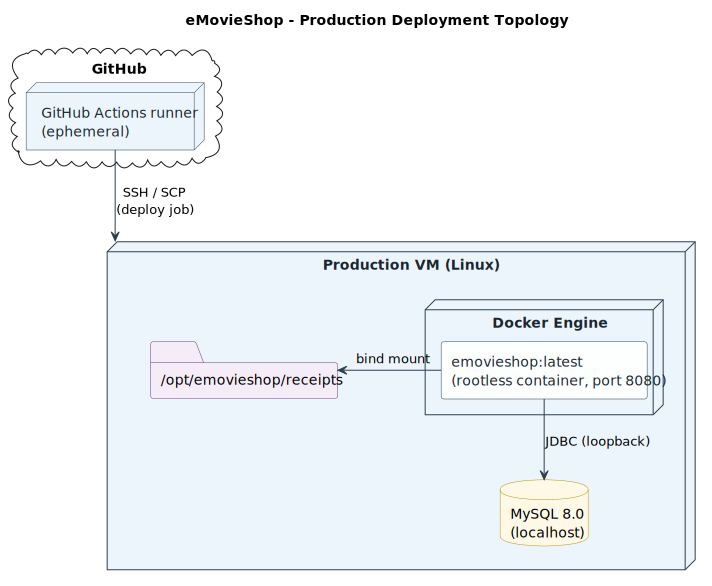

# Security Configuration and Installation - Phase 2, Sprint 2

This document describes the secure deployment procedure introduced in Sprint 2. The application is shipped as a hardened Docker image, deployed to a dedicated Linux VM by the [release-please pipeline](../PipelineAutomation/pipelineAutomation.md#3-deployment-pipeline). All secrets are managed via GitHub Secrets and the VM is treated as managed infrastructure.

## Table of Contents

1. [Deployment Topology](#1-deployment-topology)
2. [Container Hardening](#2-container-hardening)
3. [Secrets Management](#3-secrets-management)
4. [Installation Procedure](#4-installation-procedure)
5. [Configuration Management](#5-configuration-management)
6. [Deployment Traceability](#6-deployment-traceability)

---

## 1. Deployment Topology



The VM hosts:

- The Docker container running the Spring Boot application (built on the VM from the JAR + Dockerfile copied via SCP).
- A MySQL 8.0 instance reachable on the VM loopback (referenced by `DB_HOST`).
- A receipts directory under `/opt/emovieshop/receipts`, mounted into the container.

`docker-compose.prod.yml` declares the application service with `network_mode: host`, so the container reaches the local MySQL without exposing additional ports beyond 8080.

---

## 2. Container Hardening

The production image is defined in [`App/Dockerfile`](../../../../App/Dockerfile) using a multi-stage build:

| Stage | Base image | Purpose |
|---|---|---|
| Build | `maven:3.9-eclipse-temurin-21` | Resolves dependencies and packages the JAR. Discarded at runtime. |
| Runtime | `eclipse-temurin:21-jre` | JRE-only image; the build toolchain is not present. |

Hardening controls in place:

- **Non-root user.** A dedicated system user (`emovieshop:emovieshop`) is created in the runtime stage and the container runs under `USER emovieshop`. No process inside the container has UID 0.
- **No build tooling at runtime.** Maven, JDK and source code stay in the build stage; only the JAR is copied across.
- **Minimal exposure.** Only port 8080 is exposed; the host bind mount is restricted to the receipts directory.
- **Production compose file** ([`docker-compose.prod.yml`](../../../../docker-compose.prod.yml)): `restart: unless-stopped`, environment fully read from injected secrets, no inline credentials.
- **Local-development compose** ([`App/docker-compose.yml`](../../../../App/docker-compose.yml)) additionally sets `security_opt: no-new-privileges:true` and `cap_drop: ALL`. Replicating these flags in `docker-compose.prod.yml` is a known follow-up.

Image lifecycle on the VM:

- The deploy job rebuilds `emovieshop:latest` from the freshly uploaded `App/Dockerfile`.
- `docker image prune -f` runs after each deployment to remove stale layers.

---

## 3. Secrets Management

All secrets are stored as GitHub repository secrets and made available to the deploy job through environment variables; nothing is committed to source control. The complete inventory is documented in [Pipeline Automation Cap4](../PipelineAutomation/pipelineAutomation.md#4-secrets-and-variables); the table below shows where each value lands.

| Secret | Sink in the deployed environment |
|---|---|
| `VM_HOST`, `VM_USER`, `VM_SSH_KEY` | SCP / SSH actions on the runner; never reach the VM filesystem. |
| `DB_HOST`, `DB_PORT`, `DB_NAME`, `DB_USERNAME`, `DB_PASSWORD` | Passed to the SSH session via the action's `envs:` clause and consumed by `docker-compose.prod.yml`. |
| `AUTH0_*` | Same channel; consumed by the Spring Boot configuration through `application.properties` placeholders. |
| `MY_RELEASE_PLEASE_TOKEN` | Used only on the runner by `release-please-action`. |

Compliance points:

- No secret value is echoed in workflow logs; any token printed during the DAST job is masked with `::add-mask::` before being added to `$GITHUB_OUTPUT`.
- The runtime image does not embed environment values; they are injected by `docker compose` at container start.
- The MySQL account used by the container is shared between Flyway migrations and runtime CRUD. Splitting it into a migration account and a least-privileged runtime account is an open follow-up.

---

## 4. Installation Procedure

The pipeline performs every install step automatically on the production VM. For reference:

```bash
# 1. JAR + Dockerfile are uploaded under /opt/emovieshop/deploy via SCP
# 2. The SSH job then runs:
mkdir -p /opt/emovieshop/receipts
docker build -t emovieshop:latest /opt/emovieshop/deploy
cd /opt/emovieshop
docker compose -f docker-compose.prod.yml up -d
docker image prune -f
```

Manual installation prerequisites on the VM (one-off):

1. Install Docker Engine and the Compose plugin.
2. Create `/opt/emovieshop` owned by the deploy user and ensure the SSH key used by the workflow is authorised.
3. Provision a MySQL 8.0 instance reachable on the VM loopback, plus a least-privilege application database user.
4. Place `docker-compose.prod.yml` under `/opt/emovieshop/`. The file is committed to the repository and uploaded with each deployment.

The application starts with `spring.jpa.hibernate.ddl-auto=validate` and `flyway` driving migrations `V1..V10`. Startup fails fast if the schema does not match the entities, preventing silent drift.

---

## 5. Configuration Management

Production configuration is split into three layers, each with a clear owner:

| Layer | Source of truth | Notes |
|---|---|---|
| Application defaults | [`application.properties`](../../../../App/src/main/resources/application.properties) (committed) | Holds non-sensitive defaults: rate-limit thresholds, receipts directory placeholder, CORS allow-list, security headers config. |
| Runtime secrets | GitHub Secrets -> SSH `envs:` -> `docker-compose.prod.yml` | Database credentials, Auth0 client / role ids, Auth0 audience. Not present in the image. |
| Profile-specific tuning | `application-dev.properties` (developer machine only) | Enables Swagger UI / OpenAPI for local DAST scanning. Disabled by default in production via `springdoc.api-docs.enabled=false`. |

Hardening highlights enforced through configuration:

- Stack traces and detailed error messages are disabled (`server.error.include-stacktrace=never`, `server.error.include-message=never`).
- JPA stays in `validate` mode; Hibernate cannot mutate the schema.
- Actuator exposes only `health`, with `show-details=never`.
- Multipart limits are capped at 1 MB to bound the request budget.
- CORS is allow-list driven (`emovieshop.cors.allowed-origins`), never `*`.

---

## 6. Deployment Traceability

Each deployment is traceable through:

- **Conventional commits + release-please.** The release PR contains the full set of commits going to `prod`, automatically grouped in `CHANGELOG.md`.
- **Tagged releases.** Every deploy is preceded by a `release-please` PR merge that produces a Git tag, so the running version on the VM can be matched to a specific Git SHA.
- **Workflow logs.** Each `release-please.yml` run records the deploy job timestamp, the SCP destination, and the SSH commands executed.
